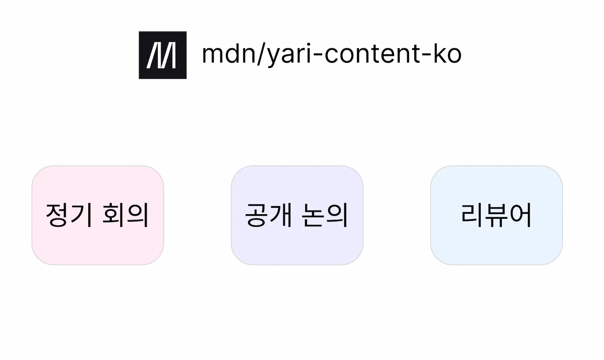
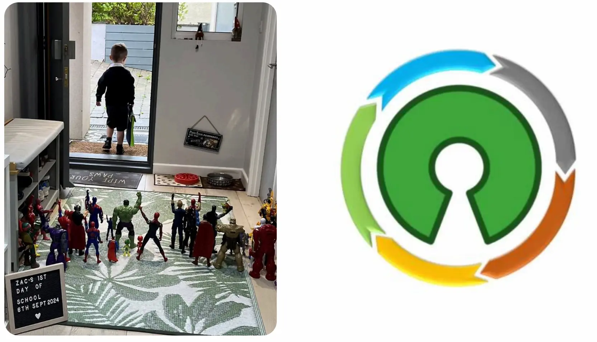

[2024 우아콘](https://2024.woowacon.com/) 이그나이트 세션에서 "오픈소스 참여 경험"을 주제로 발표하게 되었다.

조금 늦었지만, 그 과정을 정리해 보려고 한다.

## 목차

- [제안](#제안)
- [준비](#준비)
- [발표](#발표)
- [마치며](#마치며)

## 제안

우아콘 행사 준비하시는 분이 [MDN 한국 오거나이저](/posts/mdn-ko-organizer)로 같이 활동하고 있었다.

행사에 "이그나이트" 세션이 있으니 MDN 소개 및 경험 공유를 가볍게 해보는 게 어떻겠냐고 제안을 받게 되었다.

1년에 한 번씩은 공개 세미나를 하는 것이 목표였던 나는 당연히 환영이었다.

우아한형제들로 이직하고 첫 공개 외부 활동이라 걱정 반 기대받으러 참여 신청을 하게 되었다.

## 준비

이그나이트 세션은 하나의 주제로 3~5명의 발표자가 5분간 빠르게 발표를 진행하는 방식의 세션이다. 해당 세션은 참여형으로, 우아한형제들 소속뿐만 아니라 외부 발표자도 참여할 수 있다.

이그나이트는 다양한 세션으로 준비되어 있었는데, 내가 참여한 주제는 "오픈소스 참여 경험"이었다. 5분이 짧다면 짧고 길다면 길었기 때문에 어떤 주제로 공유하는 게 청중들에게 가치를 줄 수 있을까 많이 고민했었다.

### 자기검열

MDN에 합류한 지 이제 1년이 되어가던 시기였기 때문에 <u>"오픈소스"라는 주제로 내가 어떤 이야기를 하는 것이 맞을지</u>에 대한 의문도 컸다.

다행이었던 점은 나는 신입 때부터 꽤 낙천적인 스타일이어서, ["개발자를 위한 친절한 UI 컴포넌트 라이브러리 만들기"](https://engineering.linecorp.com/ko/blog/ui-component-library-for-developers-with-typescript-storybook)와 같이 사내에서 발표 기회가 있으면 도전하려고 노력했다. 이러한 경험 덕에 이번에도 심리적 부담감을 조금 덜어내고 도전해 볼 수 있었다.

그래도 연차가 쌓이니 더 조심스러워지긴 했는데 기용님이 늘 자기검열하지 말라는 말씀을 해주셔서 힘을 얻게 되었다.

> 한기용님 유투브 영상 - [겸손일까? 자기검열일까? 혹시 자신이 자신을 평가하고 있지는 않은가요?](https://www.youtube.com/watch?v=cjWpryKRGts)

### 주제 선정

도전하고자 마음먹고 나니 가장 어려운 "주제 선정"을 만나게 되었다.

내가 MDN에 엄청난 기여를 했던 것도 아니기 때문에 어떤 내용으로 가치를 줄 수 있을지 의문이 따라왔다.

그러다 내가 오픈소스에 기여하려고 노력했을 때, 기여자로서 가장 궁금했던 점이 무엇이었는지 다시 고민해 보기 시작했다. 얼마 안 가 주제가 떠올랐다. "메인테이너는 어떻게 되고 뭘 할까?"

따라서, <u>MDN 메인테이너가 되기까지의 과정을 정리하고 메인테이너로 어떤 것을 느꼈는지</u> 공유해 보자고 생각하게 되었다.

주제가 정해지니 목차는 자연스럽게 떠올랐던 것 같다. 가볍게 글로 정리하여 발표자 신청 폼을 제출했다.

### 발표자 선정

운이 좋게도 발표자로 선정되어 본격적으로 발표 준비를 할 수 있었다.

### 자료 준비

발표자 선정 공지 이후 발표 자료 제출 마감까지 약 일주일의 시간이 주어졌다.

다행히 이전에 [@mdn/yari-content-ko Organizer 합류 여정](/posts/mdn-ko-organizer)을 정리했었기에 당시 기억을 상세하게 떠올릴 수 있었다.

나는 MDN 메인테이너 활동을 소개하고 많은 분들이 MDN에 기여해 보고자 생각할 수 있도록 하고 싶었다. 따라서 아래와 같은 발표 흐름을 생각했다.

1. MDN이 무엇인지
2. 메인테이너가 되기까지의 과정
3. 메인테이너는 어떤 것들을 하는지
4. 개인적 성장은 어떤 점이 있었는지

특히 나는 번역 프로젝트가 "초심자" 분들께 미치는 영향을 잘 이해하고 있었기 때문에 이 부분을 어떻게 표현할지 고민했다.

MDN에 기여하시는 분들의 대부분 PR은 "번역"이다. 자연스럽게 학생이나 주니어가 주로 기여하는 경향이 있다. 이분들의 PR을 리뷰하며 그분들이 더 넓은 오픈소스 생태계로 뻗어나가실 수 있도록 좋은 경험을 주는 게 나에게 있어 가장 큰 도전 가치였다.

따라서 내가 오픈소스에 처음 도전할 때의 그 설렘과 두려움을 기반으로 초심자분들의 호기심을 풀어줄 수 있도록 준비했다. 이러한 내 생각은 [글또 인터뷰](https://geultto.github.io/blog/open-source/1ilsang-interview/)에 더 자세히 남겼다.

나의 생각과 발표 흐름을 정리하니 발표 자료는 금방 만들었던 것 같다. 디자인 재능이 없어 꾸미는 것이 가장 어려웠다(놀랍게도 열심히 꾸몄다ㅋ).

> 발표 PDF: [이그나이트\_기여자에서 메인테이너까지\_이상철.pdf](https://github.com/user-attachments/files/18310517/_._._.pdf)

### 발표 준비

발표 자료에 맞춰 스크립트를 작성하고 나니 5분 내로 말하는 것이 어려웠다.

그냥 읽으면서 하고 싶지 않았기 때문에 최대한 스크립트를 외우려고 했다. 그런데 이게 오히려 독이었다. 생각보다 말을 장황하게 해서 말하다가 다음 스크립트를 까먹으면 말문이 턱 막혔다. 바로 멘붕 오면서 시간을 허비하거나 횡설수설했다.

이런 것들을 고치기 위해 몇 번이고 반복하면서 발표 흐름 자체를 몸에 익히도록 노력했다. 특히 스크립트를 아예 버렸던 기억이 난다. 발표 내용과 흐름을 "이해"하고 즉흥적으로 말하기 시작했는데, 반복하다 보니 스크립트가 없었지만, 스크립트가 있는 것처럼 비슷하게 동일한 말을 했다.

## 발표

<iframe
  width="100%"
  height="400"
  src="https://www.youtube.com/embed/Ew5fyWFLOrE?si=8j-vaaQhjKuwykiG&amp;start=289"
  title="YouTube video player"
  frameBorder="0"
  allow="accelerometer; autoplay; clipboard-write; encrypted-media; gyroscope; picture-in-picture; web-share"
  referrerPolicy="strict-origin-when-cross-origin"
  allowFullScreen
></iframe>

아쉬운 점이 없다면 거짓말이겠지만 라인에서 했던 첫 발표보다는 훨씬 안정감이 생긴 것 같아 개인적으로 만족하고 있다.

상당히 민망하군요.

## 마치며

우아한형제들의 일원이 된 만큼 본격적으로 팀과 회사에 기여하여 2025 우아콘에서 좋은 내용으로 기술 발표를 할 수 있도록 준비해 보고 싶다.

내년 우아콘이 기대된다.
