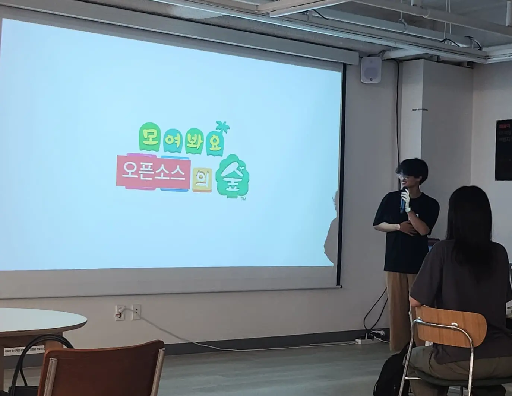
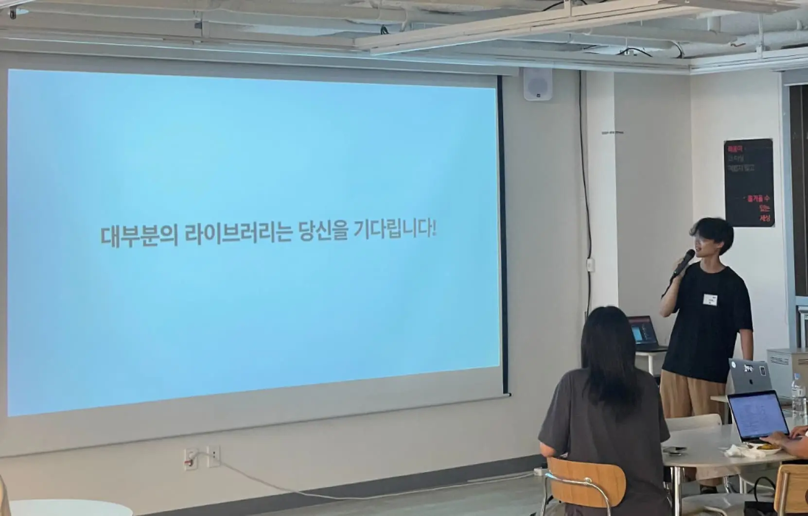
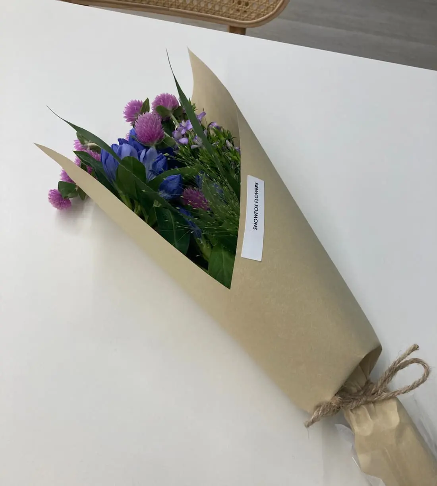

> [발표 자료 PDF 다운로드](https://github.com/1ilsang/dev/files/12504345/_1ilsang.pdf)

[글또](https://www.notion.so/ac5b18a482fb4df497d4e8257ad4d516)에서 프런트엔드 반상회를 하게 되었고 발표자를 구하여서 지원하게 되었다.

작년 넥스터즈 활동을 마지막으로 외부 발표를 하지 않았는데 이번 기회에 다시 한번 공개적으로 하고 싶다고 생각해 지원하게 되었다.

## 주제 선정

프런트엔드 반상회인 만큼 *프런트엔드 개발자에게 도움이 되는 내용*을 발표하고 싶었다.

그래서 주제를 선정하는 도중 "내가 신입일 때 가장 듣고 싶었던 세션이 무엇일까?" 고민하게 되었고 결론은 "오픈소스 분석 방법"이였다.

라인에서 처음으로 프런트엔드 커리어를 쌓을 때 받은 미션은 사내 동영상 라이브러리의 유지보수였다. `package.json`이 뭐 하는 건지도 잘 몰랐기 때문에 `UMD`, `CJS` 등은 너무나 생소했고 트리쉐이킹과 다양한 디바이스의 지원은 당시 나에겐 상당히 어려웠다.

어쨋건 라이브러리였기 때문에 다른 오픈소스 라이브러리들은 어떻게 개발하고 있는지 틈틈히 분석하면서 늘 이런 오픈소스에 나도 기여하고 싶다고 생각했던것 같다.

따라서 나는 <u>초보자를 위한 오픈소스 기여 가이드 및 핵심 코드 진입 방법</u>을 목표로 발표하기로 했다.

## 준비 과정

내 세션은 두 가지 내용이 혼합되어 있다.

1. 오픈소스 기여 가이드
2. 핵심 코드 진입 방법

위의 내용을 통해 오픈소스 코드의 첫 진입점을 찾고 기여할 수 있도록 가이드를 주고자 했다.

기여 방식을 설명하는 자리인 만큼 초보 개발자를 위해 익숙하면서도 흥미를 불러올 만한 내용으로 AtZ 친절하게 설명하고자 했다.

수많은 오픈소스에서 어떤것을 목표로 할까 고민을했고 역시 내가 기여해 봤고 자주 사용하는 오픈소스 중에서 고르게 되었다.

전체적인 구성은 기여 방법을 기준으로 3단계로 나눠 생각했다.

1. [Easy] React.dev 번역 기여와 같이 코드부와 관련 없지만 라이브러리에 기여할수 있는 문서 작업.
2. [Medium] ESLint와 같은 도구의 CLI 진입 코드와 플러그인 구성 방법.
3. [Hard] Jotai와 같이 코드에서 사용되는 코어 라이브러리의 엔트리 진입 방법.

세 단계를 구분한 이유는 Hard로 갈수록 핵심 코드의 동작 방식을 잘 이해해야 하기 때문이다.

- 번역/문서화 기여는 라이브러리 코드에 진입하지 않기 때문에 비교적 쉽게 기여할 수 있다고 생각한다. 이 단계에서 포크나 PR 방법, 오픈소스 생태계 등을 설명할 예정이다.
- ESLint와 같은 개발 도구는 ESLint 자체보단 플러그인에 대해 분석하고자 한다. 코어 로직 주변에서 전반적인 코드 구조/방식을 이해할 수 있어 핵심 코어 기여보단 쉽다고 생각한다. 라이브러리의 확장과 플러그인 구조, CLI 등을 설명하고자 한다.
- Jotai와 같은 코어 라이브러리는 라이브러리도 잘 알아야 하고 같이 사용되는(React, Next 등) 코드와의 관계도 이해하고 있어야 하므로 어렵다고 생각한다. 여기는 가볍게 코드 진입과 빌드, 배포에 관해 설명하려고 한다.

어느 정도 틀이 갖춰진 다음에는 빠르게 PPT 작업을 할 수 있었다.

20분 발표이고 청중이 초보 개발자인만큼 가볍게 다양한 기여 예제를 보여주고자 했다.

장표의 마지막에는 오픈소스에 지속해서 노출되는 방법을 추가하며 마무리했다.

## 발표 당일

타임테이블이나 스티커의 디자인이 깔끔하게 잘 뽑혔다. 운영진분들의 노고가 느껴졌다.

> 압도적 감사..!

세션은 팀 스파르타에서 진행되었는데 내부가 탁 트이고 깔끔해서 세션하기에 좋은 장소였다.

 

발표는 크게 떨리진 않았던 것 같다.

스무스한 행사 진행에 힘입어 청중들도 잘 호응해 주셨다.

혼자 떠드는 발표를 하고 싶지 않아서 청중과 눈을 마주친다거나 질문을 한다거나 여유 있게 행동하고 싶었는데 매우 쉽지 않았다.ㅋ

장표를 넘기기 전에 다들 어떻게 듣고 계시는지 궁금해서 종종 청중들을 바라봤는데 다들 엄청나게 집중해 주셔서 압도적 감사함을 느꼈다. 그래서인지 자신감을 가지고 더 여유롭게 떨지 않으면서 발표할 수 있었다.

확실히 열의 있는 분들과 함께 현장에서 발표하 는게 훨씬 좋고 인상적이라 느꼈다. [영상으로 발표](https://engineering.linecorp.com/ko/blog/ui-component-library-for-developers-with-typescript-storybook)할때는 오히려 힘들었다.

 

20분 정말 짧았다. 마이크 들자마자 끝난 느낌이었다.

10분간 QnA도 진행되었는데 생각보다 질문을 많이 해주셔서 조금 기뻤다.

특히 인상 깊었던 질문 중 하나는 <u>기여하고 싶은 라이브러리의 조건</u>에 대한 질문이었는데 내가 회사에서 라이브러리를 개발하면서 중요하게 생각했던 부분을 말할 수 있었다.

아무리 좋은 라이브러리라도 결국은 다른 개발자가 사용하기에 "편해야"한다. 나는 라이브러리는 <u>DX가 무엇보다 중요하다</u>고 생각한다. 따라서 문서화를 비롯해 IDE 단계에서의 편리함(코드의 간결함이나 타입 추론과 주석 등)이 기여하고 싶은 라이브러리의 조건이 되지 않을까 생각한다.

소신것 준비한 만큼 후회 없이 발표했다.

## 마치며

연사자들에게 꽃을 나눠주셨는데 매우 민망(ㅋㅋ) 감사합니다.

발표를 준비하면서 스스로 공부가 많이 되었다.

앞으로도 꾸준히 공부해서 좋은 내용으로 다른 분들에게 공유할 수 있도록 노력하고자 한다.

열정이 솟아난 8월이었다.

> [발표 자료 PDF 다운로드](https://github.com/1ilsang/dev/files/12504345/_1ilsang.pdf)
