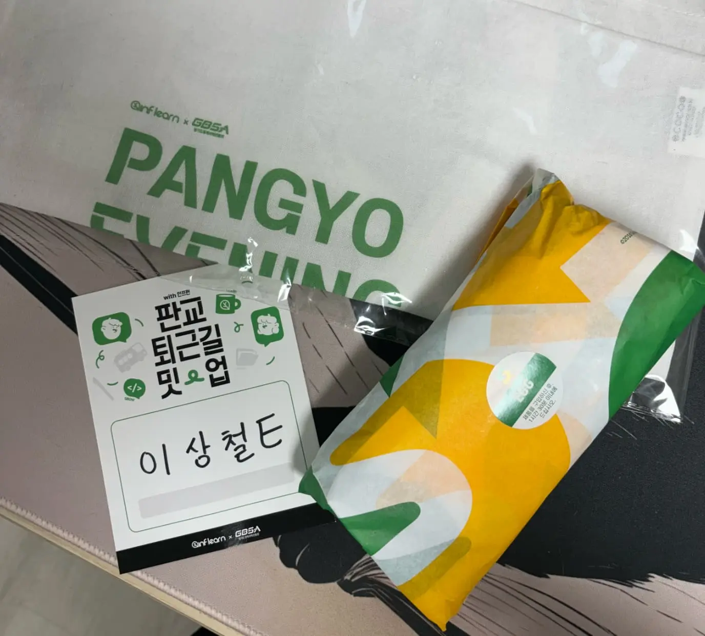

{(globalThis.slug = 'inflearn-meetup-03-dev-career') && ''}

학생 때는 개발자 모임에 많이 참여했었는데 요즘은 거의 나간 적이 없었다.

마침 [인프런](https://inflearn.com/)에서 재밌어 보이는 모임을 개최하고 있었기에 신청하게 되었다.

## 소개

> [인프런 공식 행사 소개](https://www.inflearn.com/course/%ED%8C%90%EA%B5%90-%ED%87%B4%EA%B7%BC%EA%B8%B8%EB%B0%8B%EC%97%85-%EC%9D%B8%ED%94%84%EB%9F%B0-%EA%B0%9C%EB%B0%9C%EC%9E%90%EC%BB%A4%EB%A6%AC%EC%96%B4)

행사는 판교 퇴근길 밋업의 세 번째 주제로 <u>개발자 커리어</u>를 다뤘다.

연사는 [27년차 실리콘밸리 개발자의 인생 이야기](https://www.youtube.com/watch?v=nLL409se8sM)로 유명한 한기용님이다.

영상을 보면서 흥미롭다고 느꼈는데 직강을 볼 수 있다는 소식에 설레는 마음으로 신청했던 기억이 난다.

"실리콘밸리에서 인정받는 개발자의 특징 10가지"라니 듣지 않을 수가 없었다.

## 행사

> 개발자 행사의 꽃은 굿즈가 아닐까?

조금 일찍 갔기 때문에 샌드위치 먹으면서 행사 시작까지 사람들 구경했다.

 

본격적으로 세션이 시작되었고 기용님 본인 소개가 시작되었다.

지금까지 쌓아오신 커리어가 다채롭다고 느껴졌다. 그렇기에 이렇게 연사로 계신 걸까? 나도 다양한 환경을 경험해 보고 싶다고 생각했다.

세션은 전반부와 후반부로 나뉘어서 진행되었다.

### 커리어를 바라보는 관점

전반부는 커리어 어떻게 이어 나갈지에 대한 내용이었다. 내가 공감이 많이 갔던 부분은 아래와 같다.

 

1. `많은 회사를 다녀봐라`
   - 어떤 매니저가 나랑 잘 맞는지 찾아야 한다
2. `현재에 충실하기`
   - 불안하니까 선행학습을 한다. 필요하지 않은 학습을 하지 마라
3. `서포터를 잘 만나기`
   - 무언가 추진할 때 지지해 줄 사람이 있어야 한다

 

어떤 매니저/동료를 만나느냐에 따라 성장의 곡선과 마음의 상처가 달라지는 것을 겪기도 하고 보기도 했다.

본인의 잘못이라고 책망하는 경우가 많은데 시스템적인 문제 혹은 그냥 문화가 안 맞는 것일 수도 있다.

나의 경우는 주변에서 칭찬하면 더 열심히 하는 경향이 있는데, 최근 특히나 서포터들의 힘을 많이 느낀다(😭😭😭👏👏).

### 개발자로서 생각해 보면 좋을 10가지

후반부는 개발자로서 생각해 보면 좋을 10가지를 소개해 주셨다.

 

1. 기본기
2. 학습 능력
3. 의사소통
4. 문제정의
5. 시간 추정
6. 운영 고려 코드 작성
7. 서비스 사고 대처
8. 결과 지향
9. 영향력
10. 리더 vs 전문가

임팩트(결과)를 어떻게 낼 것인지에 대한 고민이 핵심이고 그것을 위한 스킬들을 설명해 주셨다고 생각된다.

특히 처음부터 끝까지 강조하신 "결과 지향적 개발자"는 내가 가져야 할 핵심 포인트라 느꼈다.

### Q&A

세미나가 끝나고 Q&A 시간이 주어졌다. 흥미로웠던 질문 두 가지를 가져와 봤다.

`"해고에 대한 걱정은 없으신지?"`

- 한국에서는 해고가 불명예의 느낌이지만 밸리에서는 누구나 해고당한다.
- 해고 패키지를 잘 받도록 노력하자. 첫 번째 레이오프는 많이 챙겨주므로 오히려 먼저 나가는 게 좋을 수 있다.

`"나에게 맞는 것, 맞지 않는 것을 어떻게 구분하셨고 받아들이셨나요?"`

- 내 매니저가 어떤 사람인가를 많이 봤다.
- 매니저를 잘 만나야 이후의 가치 판단이 된다.

### 네트워킹

모든 세션이 끝나고 네트워킹이 진행되었다.

네트워킹 시간은 사전 설문조사의 내용을 기반으로 관심도가 비슷한 사람들과 묶어주셨다.

잡담을 많이 했는데 시간 가는 줄 몰랐다. 시간이 부족할 정도.

## 마무리

<ImageHorizonWrap list={['book', 'letter']} />

기용님이 최근 출판하신 [실패는 나침반이다](https://product.kyobobook.co.kr/detail/S000212569197) 도서를 지참해서 오면 친필 사인을 해주는 이벤트가 있었다.

기용님에 대한 개인적인 관심이 컸기 때문에 얼른 사인받으러 갔다.

<u>커리어를 긴 호흡으로</u> 바라보라는 점에 동의하고 있다. 나는 너무 조급한 게
아닐까?

조금 더 적극적으로 삶을 가꾸고 나를 사랑해야겠다.

오랜만의 개발자 모임에서 에너지를 많이 받았다. 앞으로도 종종 찾아다녀야겠다.

Love yourself.
