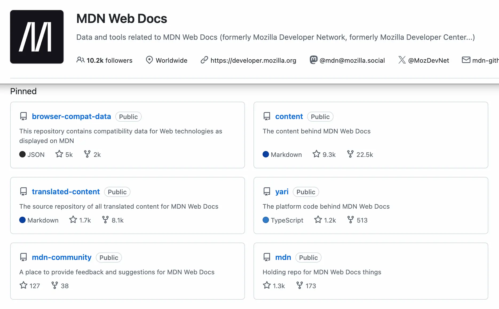
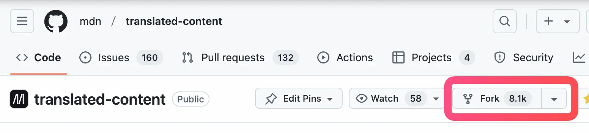
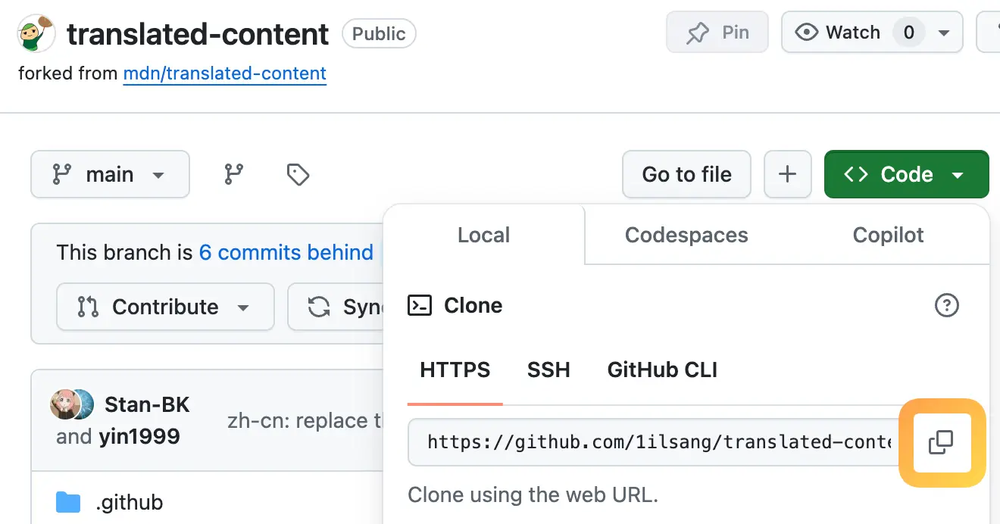
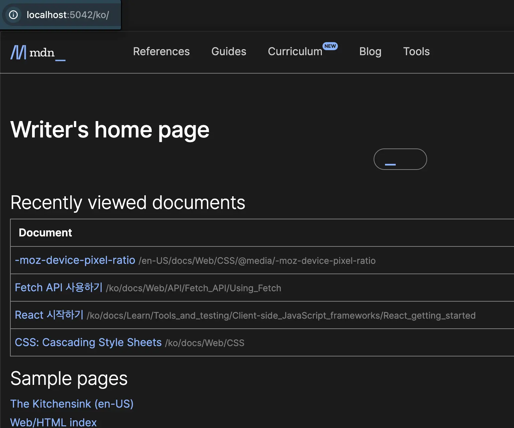
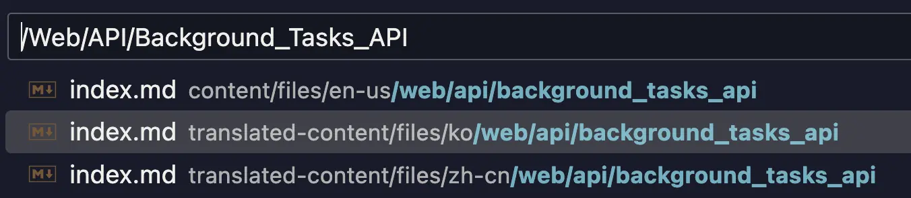
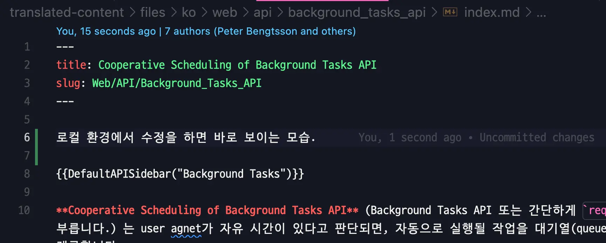
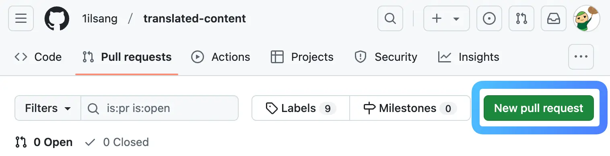

[MDN 메인테이너 합류](/posts/mdn-ko-organizer) 이후 많은 분에게 번역 기여를 권했었다. 그런데 막상 초심자분들을 위한 상세한 가이드가 없다는 것을 깨닫고 이번 기회에 작성해 보려고 한다.

## TL;DR

- yari, content, translated-content 저장소 차이를 이해한다.
- 개발 서버는 `content` 에서 실행한다.
- 문서 번역은 `translated-content` 에서 진행한다.

## 목차

- [목차](#목차)
- [MDN 리포지터리 관계](#mdn-리포지터리-관계)
  - [Yari](#yari)
  - [Content](#content)
  - [Translated-content](#translated-content)
- [리포지터리를 가져오는 방법](#리포지터리를-가져오는-방법)
- [로컬 개발 환경 설정하기](#로컬-개발-환경-설정하기)
- [실행하기](#실행하기)
- [번역 가이드 확인하기](#번역-가이드-확인하기)
- [PR 생성하기](#pr-생성하기)
- [마치며](#마치며)

## MDN 리포지터리 관계



[MDN Organization](https://github.com/mdn)에는 다양한 저장소가 있다. 우리는 여기서 `yari`, `content`, `translated-content` 세 저장소만 이해하고 있으면 된다.

> 저장소 [계층 설명](https://developer.mozilla.org/ko/docs/MDN/Community/Contributing/Our_repositories)을 확인하면 저장소가 어떤 용도로 나뉘어 있는지 확인할 수 있다.

### Yari

[yari](https://github.com/mdn/yari)는 <u>MDN 문서들을 엮어 웹 사이트로 만들어주는</u> 문서화 플랫폼 저장소다. [기존의 WYSIWYG에서 변경](/posts/mdn-ko-organizer#%EC%97%AD%EC%82%AC)되었다.

`content` 및 `translated-content`에 작성된 문서를 엮어 정적 웹 사이트로 빌드해 주는 플랫폼에 해당한다.

따라서 문서 내용 외부의 Navigation, Tab, Footer 등 웹 사이트 동작에 기여하려면 여기 저장소의 코드를 확인해야 한다.

동작 방식이 궁금하다면 [How it works](https://github.com/mdn/yari?tab=readme-ov-file#how-it-works)를 참고하면 된다.

### Content

[content](https://github.com/mdn/content)는 MDN 웹 문서 원본이 모여있는 저장소다. 언어는 영어로 통일되어 있기 때문에 `files/en-us/**`만 존재한다.

문서의 최신화, 내용 오류 수정 및 새로운 문서를 작성하고 싶다면 여기 저장소에 기여하면 된다.

### Translated-content

대망의 [translated-content](https://github.com/mdn/translated-content)는 content에 저장된 원본 문서를 <u>번역한 문서들을 모아놓은 저장소</u>다.

따라서 content와 폴더 구조가 동일하며 한국어, 일본어 등 번역 주체에 따라 `files/ko/**`, `files/ja/**` 등으로 지역 코드가 변경된다.

> NOTE: 특정 지역으로 MDN 문서에 접근했을 때 번역된 문서가 없을 경우 en-us 파일로 리다이렉트 된다.

원본 문서 번역, 번역 문서의 문맥 수정 등의 기여는 여기 저장소에 기여하면 된다.

대부분의 MDN 기여는 `translated-content` 저장소에 PR을 날리는 상황에 해당하므로 이 글에서도 해당 저장소에 기여하는 방법을 다루도록 하겠다.

## 리포지터리를 가져오는 방법

`translated-content`에 기여하기 위해 원격 저장소를 내 컴퓨터로 가져와야 한다.



MDN 저장소에 바로 push 할 권한이 없으므로 `fork`로 해당 저장소를 내 저장소로 가져온다.



내 저장소를 [IDE](https://namu.wiki/w/%ED%86%B5%ED%95%A9%20%EA%B0%9C%EB%B0%9C%20%ED%99%98%EA%B2%BD)에서 실행시키기 위해 HTTPS URL을 복사한다.

```sh
$ git init # 깃 초기화
$ git remote add origin {HTTPS_URL} # 저장소를 origin으로 추가
$ git pull origin main # origin 저장소의 main 브랜치 가져오기
$ yarn install # 해당 브랜치의 종속 라이브러리 설치
```

이제 최신 브랜치를 IDE로 가져왔으므로 위와 같이 순차적으로 [CLI](https://aws.amazon.com/ko/what-is/cli/)에 입력한다.

> GitHub과 관련된 더 자세한 내용은 [기여 준비하기](https://developer.mozilla.org/ko/docs/MDN/Community/Contributing/Getting_started#%EA%B8%B0%EC%97%AC_%EC%A4%80%EB%B9%84%ED%95%98%EA%B8%B0) 문서를 추천한다.

## 로컬 개발 환경 설정하기

위의 [리포지터리를 가져오는 방법](#리포지터리를-가져오는-방법)에서 `translated-content`를 가져왔다. 하지만 실제 개발 환경을 실행시키기 위해선 `content` 저장소도 필요하다.

동일하게 `content` 저장소도 로컬에 가져온다.


> content, translated-content 두 저장소 모두 가져와야 한다.

웹 사이트를 빌드하는 `yari`가 `content`에 내장되어 있기 때문에 `content`로 사이트를 띄우고, 실제 번역을 `translated-content`에서 진행하는 방식으로 작업하게 된다.

`content` 저장소를 가져왔다면 `yarn install`으로 종속성 설치를 해준다.


```md
CONTENT_TRANSLATED_ROOT=/path/to/translated-content/files
EDITOR=code
```

이후 `content` 폴더 root에 `.env` 파일을 생성한 다음 위의 내용을 추가한다(IDE가 vscode가 아닐 경우 EDITOR 제거).

`/path/to`에는 `translated-content` 폴더가 설치된 상위 경로를 입력해야 한다. pwd 명령어로 확인 가능하다.



이제 어려운 것들은 끝났다.

`content` 폴더에서 `yarn start` 이후 `localhost:5042`에 접근하면 사이트가 보인다.

## 실행하기

본격적으로 번역하기 전에 개발 환경에 조금 더 익숙해져 보자.

만약 `http://localhost:5042/ko/docs/Web/API/Background_Tasks_API`의 문서를 수정하고 싶다면 어떻게 해야 할까?



URL의 `/ko/docs` 뒷 부분 `/Web/API/Background_Tasks_API`를 IDE에서 파일 검색해 본다.

`en-us`, `ko`, `zh-cn` 하위에 파일이 존재하므로 영어, 한국어, 중국어 문서가 존재한다고 생각하면 된다. 우리는 `ko` 하위의 `index.md` 파일로 접근한다.



`index.md` 파일에서 내용을 수정 후 브라우저 새로고침을 해보자.


🎉 TA-DA! 🎉 로컬 환경이 정상적으로 반영된 것을 알 수 있다.

이로써 우리는 아래의 3가지를 이해하게 되었다.

1. content, translated-content 관계
2. 개발 서버는 `content` 에서 실행
3. 문서 번역은 `translated-content` 에서 진행

## 번역 가이드 확인하기

문서의 통일을 위해 [각 현지화 문서에는 가이드라인이 존재](https://github.com/mdn/translated-content/blob/main/docs/README.md)한다.

한국도 마찬가지로 번역 가이드 문서를 제공하므로 필요에 따라 아래의 링크에서 확인하면 된다.

- [한국어 번역 지침서](https://github.com/mdn/translated-content/blob/main/docs/ko/README.md)

특히 추천하고 싶은 문서는 아래와 같다.

1. [번역 안내서](https://github.com/mdn/translated-content/blob/main/docs/ko/guides/translation-guide.md)
   - 문체, 개행 등 번역 전반적인 내용을 다룬다.
2. [용어 안내서](https://github.com/mdn/translated-content/blob/main/docs/ko/guides/glossary-guide.md)
   - example을 '예제'로 번역할지 '예'로 번역할지 등 자주 사용되는 용어의 번역 가이드다.
3. [Meta Data 안내서](https://github.com/mdn/translated-content/blob/main/docs/ko/guides/meta-data-guide.md)
   - 원본 문서와의 최신화 정보를 확인하기 위해 모든 번역 문서는 MetaData를 활용하고 있다.

## PR 생성하기

번역된 문서를 반영하기 위해 `translated-content`에서 PR을 생성한다.

```sh
$ git add .
$ git commit -m {YOUR_COMMIT_MESSAGE}
$ git push origin {YOUR_BRANCH}
```

origin 저장소로 번역 내용을 push 한다.

<div> </div>

깃헙 사이트에 접속해 PR 생성하기를 선택 후 내 저장소에서 `translated-content`의 `main`을 목표로 PR을 생성하면 된다.

PR 본문 작성은 [예제 PR](https://github.com/mdn/translated-content/pull/12137) 혹은 저장소의 다른 PR들을 참고하면 된다.

이제 리뷰어의 응답에 따라 merge 혹은 추가 작업이 진행된다.

## 마치며

핵심만 가볍게 적으려 했는데 생각보다 글이 길어졌다. 그만큼 친절한 가이드를 작성하자고 한 것이니 너그럽게 찬찬히 봐주시길 부탁드리고 싶다.

기여 과정이 복잡하다는 것은 곧 텐션이 떨어지게 된다는 것이므로 지금보다 더 간략화할 방법이 있을까 고민하는 계기가 되었다.

초심자들이 MDN 기여를 통해 오픈소스에 좋은 인상을 얻고 누구나 할 수 있다는 자신감을 가질 수 있도록 하고 싶다.

MDN 한국팀이 궁금하다면 [MDN Discord #korean 채널](https://discord.com/channels/1009925603572600863/1070064829466939503) 혹은 [Google Groups (yari-content-ko)](https://groups.google.com/g/yari-content-ko)에서 소식을 받아볼 수 있다.
