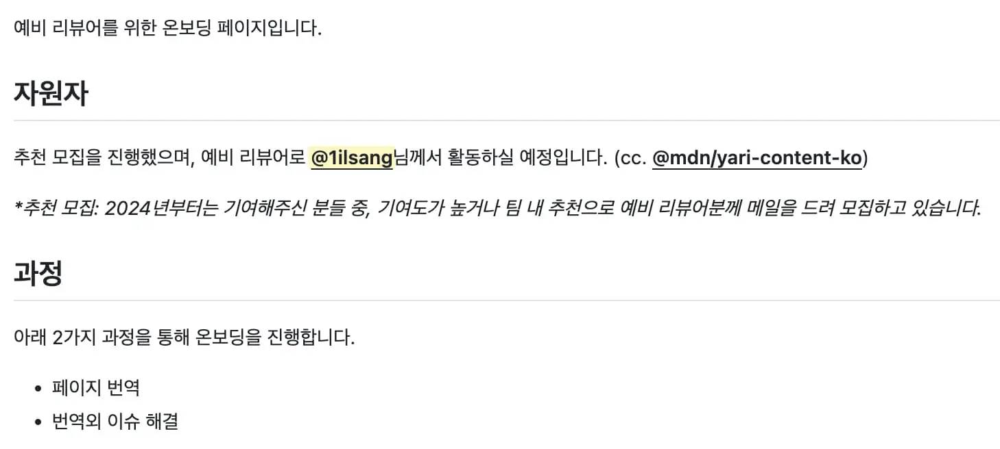
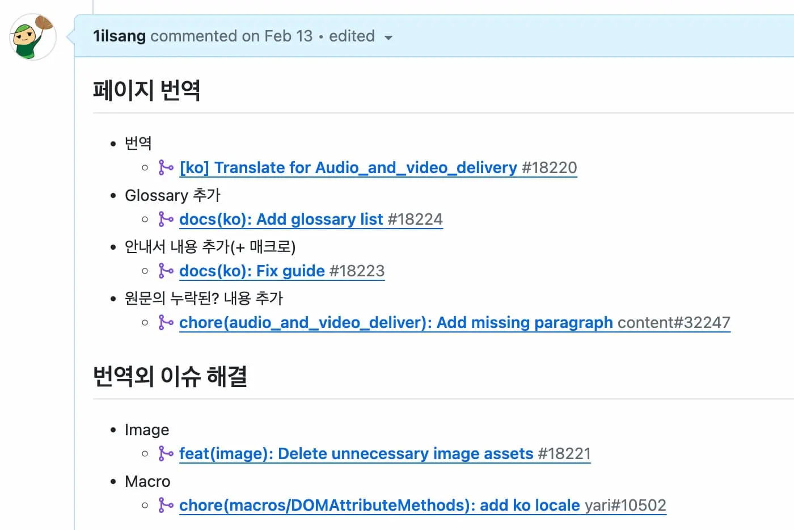
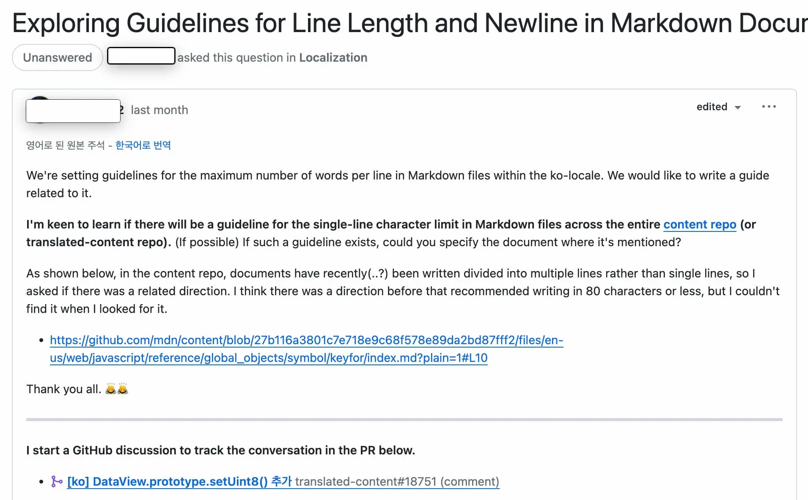
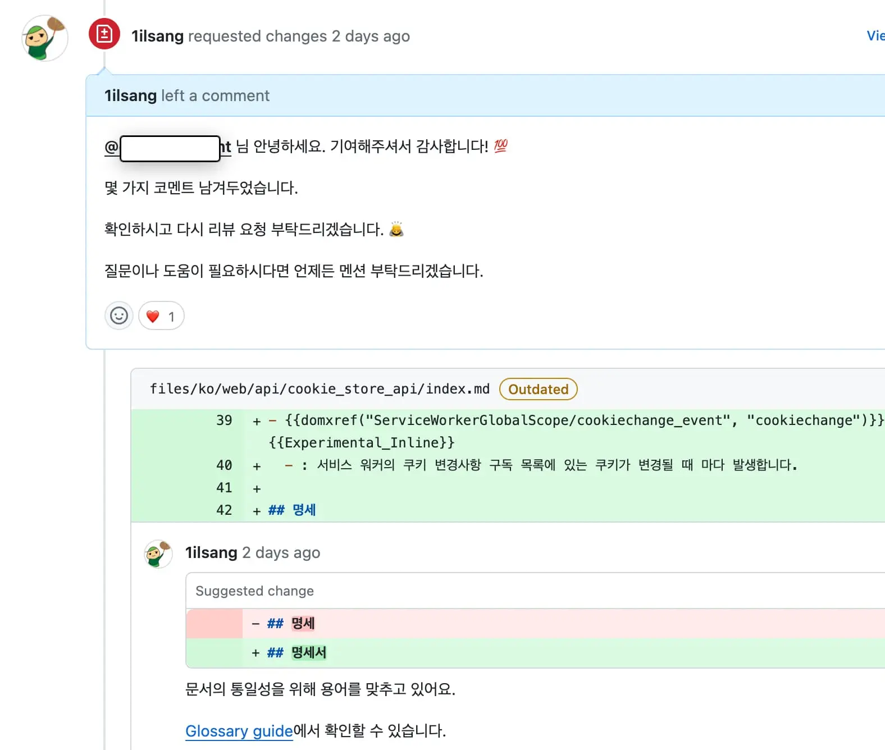

최근 [@mdn/yari-content-ko](https://developer.mozilla.org/en-US/docs/MDN/Community/Contributing/Translated_content#korean_ko) 팀에 합류하게 되었다.

오픈소스 프로젝트의 방향성을 계획하고, 리뷰어로 활동하는 것은 처음이었기에 들뜬 마음으로 임할 수 있었다.

이 글을 통해 MDN 및 나의 합류 과정을 정리해 보려고 한다.

## Index

- [MDN?](#mdn)
- [합류 여정](#합류-여정)
- [합류 후](#합류-후)
- [올해 목표](#올해-목표)
- [마무리](#마무리)

## MDN?

> https://github.com/mdn

MDN은 Readme에 그 목적이 잘 나타나 있다.

MDN 웹 문서는 CSS, HTML, JavaScript, Web API를 비롯한 <u>웹 플랫폼 기술을 문서화</u>하는 오픈소스 프로젝트이다.

 

[MDN 사이트](https://developer.mozilla.org/)에 들어가면 방대한 기술 문서를 확인할 수 있다.

### 임무

MDN의 임무는 "더 나은 인터넷을 위한 청사진을 제공하고 새로운 세대의 개발자와 콘텐츠 제작자가 이를 구축할 수 있도록 지원하는 것"이라고 되어 있다.

해당 임무에 걸맞게 MDN 문서들은 다양한 웹 플랫폼 기술의 올바른 사용법과 해석을 하기 위해 노력하고 있다.

### 역사

MDN은 2005년에 시작되어 문서 전체가 오픈소스로 운영되어 누구나 참여할 수 있는 프로젝트이다.

초창기에는 모든 문서가 SQL 데이터베이스에 존재하고 [WYSIWYG](https://ko.wikipedia.org/wiki/%EC%9C%84%EC%A7%80%EC%9C%84%EA%B7%B8) 편집기로 변경했다. 이때는 한국 로케이션이 활성화 안되어 있었기 때문에 번역 문서에 "역자주" 등 주관적 의견이 많이 추가되어 있었다. 이는 긍정적인 면도 있지만 전체적으론 통일성이 부족해지고 각 문서의 품질이 떨어지기도 했다.

2020년 기존 문서화 툴을 [yari](https://github.com/mdn/yari)로 변경하면서 git을 통한 체계적인 기여와 통일성 있는 문서로 발전하게 되었다.

> 관련 내용: [Welcome Yari: MDN Web Docs has a new platform](https://hacks.mozilla.org/2020/12/welcome-yari-mdn-web-docs-has-a-new-platform/)

이후 2021년 4월 `yari-content-ko`팀이 창설되면서 [한국 로케일도 활성화 되었다](https://egas.tistory.com/16). 이때부터 한국 MDN 문서도 체계적인 리뷰 시스템이 존재하게 되었다.

## 합류 여정

이제 나의 썰을 조금 풀어보려고 한다.

### 문서화에 대한 관심

2021년에 [번역 오픈소스 기여 가이드](https://blog.naver.com/1ilsang/222517766844) 글을 작성한 적이 있다.

본문에서 언급되어 있듯 나는 오픈소스에 기여하고 싶었지만 기술 이전에 영어에 대한 부족함을 많이 느꼈다. 어쩌면 이것이 문서화에 대한 열망으로 표출되었다고 생각한다.

당시 내가 재직 중이던 [LINE+에서 Webpack 한글화 작업이 진행](https://github.com/line/webpack.kr)되고 있었다.

운이 좋았다고 생각된다. 팀원들의 기여 과정을 어깨너머로 보면서 하고 싶다고 느꼈고 실제로 조금씩 기여하기 시작했다.

이때의 경험이 상당히 좋았기 때문에 이후 [React.dev](https://github.com/reactjs/ko.react.dev) 및 [MDN](https://github.com/mdn/translated-content)에도 조금씩 기여하게 되었다.

### 사내 오픈소스 스프린트 참여

사내 DevRel 팀에서 오픈소스 기여 행사를 열었다. 이때 MDN 문서 번역 프로젝트가 있어 참여해 본격적으로 번역 기여를 하기 시작했다.

이때 PR을 꽤 열심히 날려서 기여 1등으로 행사를 마무리했다.

### 온보딩 과정 진행

행사 이후에도 MDN에 꾸준히 기여하던 중 운이 좋게도 `yari-content-ko` 팀원 제안 메일을 받게 되었다.

내 대답은 당연히 YES였기 때문에 바로 온라인 티타임을 가졌다. 상당히 친절하게 맞아주셔서 감동이었다.

이후 [본격적인 리뷰어 온보딩 과정이 시작](https://github.com/mdn/translated-content/issues/18056)되었고 오픈소스답게 공개적으로 이슈를 생성해 과정을 전체 공유했다.

다행히 무사히 과제를 끝낼 수 있었고 본격적으로 리뷰어로 활동하게 되었다.

## 합류 후

`@mdn/yari-content-ko` 팀은 MDN 한국 문서에 대한 전체 권한을 가지고 있다. 기여 PR 리뷰와 유지보수 및 한국 지역 활성화에 대한 고민을 함께 하고 있다.

팀에 합류하면서 크게 3가지 달라진 점이 있었다.

### 정기 회의

정기 회의를 통해 전체적인 방향성에 대한 싱크를 맞추고 PR 리뷰에 이상이 없는지 등 검증하는 시간을 가졌다.

### 공개 논의

> https://github.com/orgs/mdn/discussions/655

문서 번역 리뷰나 프로젝트에 대한 의견 제시 등 공개적인 논의를 함께 이야기하게 되었다.

### 리뷰어 활동

아마도 가장 크게 달라진 부분이라 생각한다. 컨트리뷰터에서 리뷰어가 되면서 기여해 주신 PR을 검토하고 있다.

이 부분이 꽤 까다롭지만 보람을 느끼고 있다. 기여자의 열정이 식지 않도록 빠르고 친절하게 응답하려고 노력하고 있다.

이모지의 힘이 크다고 느끼고 있다. 하트 감사합니다.

## 올해 목표

팀원이 기여 목표를 세우는 것을 보고 감명받아 나도 세웠다.

1. CSS 한국어 번역 50%까지 올리기
2. 번역 자동화 스크립트 추가

현재는 번역 리뷰 시 [Glossary](https://github.com/mdn/translated-content/blob/main/docs/ko/guides/glossary-guide.md)를 수동으로 확인하고 있다. 이 부분을 자동화하고 CSS 번역을 꾸준히 해보려고 한다.

## 마무리

번역은 오픈소스 입문의 좋은 시작점이라 생각한다.

그렇기 때문에 리뷰어로서 사명감을 느끼고 있다. 오픈소스를 시작하려는 분들이 꾸준히 기여하고 생태계를 끌어 나갈 인재로 성장할 수 있도록 좋은 경험을 주고 싶다.

MDN 문서 번역에 관심이 생겼다면 [오픈소스 기여 첫걸음, MDN 문서 번역 가이드](/posts/mdn-contributing-translations) 및 [첫 기여자들을 위한 안내서](https://github.com/mdn/translated-content/blob/main/docs/ko/README.md)를 참고해 주시길 바란다.
