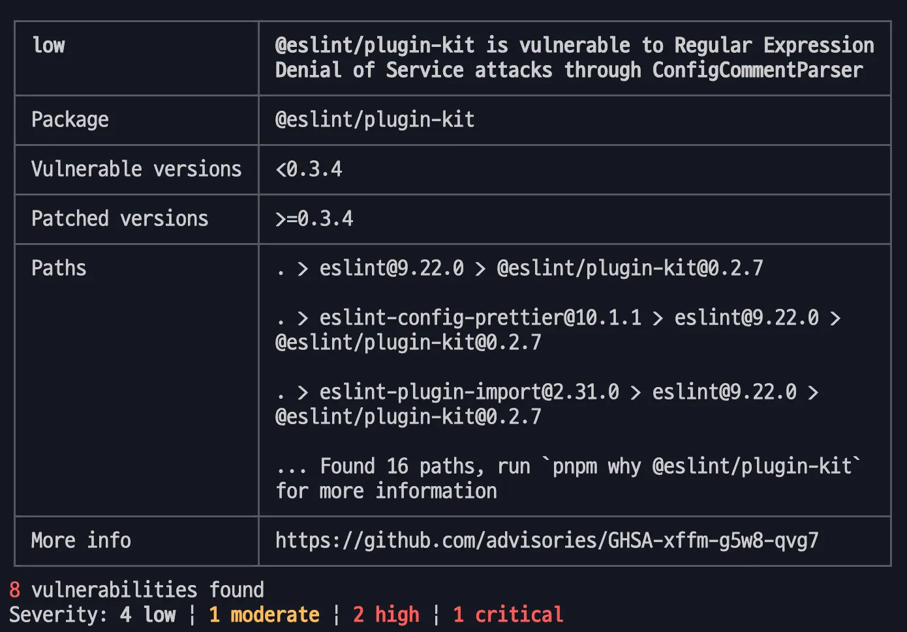

## 들어가며


새벽 2시반, 잠들기 직전에 Node.js 디코에서 `@everyone`이 찍혔다. 이런 경우는 디코가 생긴 이후로 최초이므로 호기심이 발동해 직관을 하게 되었다.

- 내용인즉 chalk, debug, color 등 을 관리하는 메인테이너의 계정이 탈취, 악성코드가 담긴 버전이 배포 됨
  - 영향 받는 범위는 @babel/core, express, Node.js, Next.js 등 엄청나게 컸음
    - 주간 다운을 합치면 20억이 넘음
- 멀웨어 스크립트에는 `typeof window !== 'undefined` 코드가 있는데, CICD 환경 등에 침투하여 암호화폐 탈취를 위한 스크립트가 있었음.
- 관련 링크들
  - [해킹당한 메인테이너의 대응이 궁금하면 여기](https://github.com/debug-js/debug/issues/1005)
  - https://github.com/advisories/GHSA-8mgj-vmr8-frr6
  - [사건 요약](https://www.aikido.dev/blog/npm-debug-and-chalk-packages-compromised)

최근 <u>메인테이너 계정이 탈취되고 패치버전이 올라가는 문제</u>들이 많이 생기고 있다.

이번 포스트에서는 비슷한 경우인 `is` 패키지의 토큰 탈취 과정과 공격 코드 분석을 해보려고 한다.

## TL;DR: 무슨 일이 벌어졌나?

- [npm](https://www.npmjs.com/) 패키지 [eslint-config-prettier](https://www.npmjs.com/package/eslint-config-prettier)(주간다운2000만), [is](https://www.npmjs.com/package/is)(250만) 등에 악성코드가 추가됨
  - is 패키지는 타입 체크를 도와주는 기분적인 유틸 패키지
  - is.symbol(…), is.nan(…) 등<ExternalAnchor href="https://github.com/enricomarino/is/blob/cb4d31da1fe9e315e4bd917b063c636bf110e2b2/index.js#L558" />
- 공격자는 이전 메인테이너의 계정을 탈취해 악성 코드가 포함된 버전을 배포
- 유저가 해당 패키지를 설치하게 되면 각종 정보가 해커에게 전송 되고 실행 명령어가 그대로 노출 됨

## 공급망 공격이란?

Supply Chain Attack(공급망 공격)의 정의는 아래와 같다.

- 해커가 SW나 HW 개발 단계부터 악성코드를 제품의 악의적 변조 또는 제품 내부에 악성코드 등을 숨기는 공격기법
- 대표적인 예로 [스턱스 넷](https://ko.wikipedia.org/wiki/%EC%8A%A4%ED%84%B1%EC%8A%A4%EB%84%B7)이 있으며, 스턱스 넷의 경우 초기 개발단계부터 악성코드가 유입된 사례
  - [KISA > 정보보호 용어 > 공급망 사슬 공격](https://www.krcert.or.kr/kr/bbs/list.do?bbsId=B0001020&menuNo=205025&pageIndex=1&searchCnd=1&searchWrd=supply%20chain%20attack)
- 제 3자 공격이라고도 불리며 주요 벤더사의 종속성에 침투하여 클라이언트의 시스템과 정보에 접근한다
  - [공급망 공격이란? | Cloudflare](https://www.cloudflare.com/ko-kr/learning/security/glossary/supply-chain-attack/)

## 메인테이너 계정 탈취 과정


1. 메인테이너들에게 자격증명을 요청하는 이메일이 발송 됨
   - 이메일은 support@npmjs.org 주소를 위조
2. 링크를 누르면 `npnjs`(npmjs가 아님)로 이동
   - 이러한 오타 피싱을 타이포스쿼팅 공격(Typosquating Attack)이라 함
   - 피싱 사이트에 <u>토큰이 쿼리로</u> 되어 있는데 이는 특정 메인테이너를 추적하기 위함
3. 메인테이너는 피싱 사이트를 npmjs.org 로 오인해 로그인 진행


&nbsp;4. 계정 탈취 및 토큰 생성 완료

- `automation` 타입의 토큰은 `npm publish` 사용시 **2FA 정책을 사용하지 않는다.**

BOOM!

## 공격 코드 분석

그렇다면 악성 코드는 어떤 형태일까? 이번에는 공격 코드를 분석해보자.

코드 전문은 https://socket.dev/npm/package/is/files/5.0.0/index.js 에서 확인 가능하다.

### 1. 패키지 설치와 postinstall

```json
// is/package.json
{
  "name": "is",
  "version": "5.0.0",
  "scripts": {
    "postinstall": "node index.js"
  // ...
}
```

1. 사용자가 `npm i is`를 하게 되면
2. `postinstall`이 실행되면서
3. 해킹 코드가 있는 `index.js` 파일을 실행하게 된다.

### 2. 동적 함수 선언과 실행

```js
// index.js
Function(
  'of‌',
  `var throw‌‌‌‌‌‌‌‌‌‌‌‌‌,do‌‌‌‌‌‌‌‌‌‌‌‌‌‌‌‌,public‌‌‌‌‌‌‌‌‌‌‌‌,case‌‌‌‌‌‌‌‌‌‌‌‌‌‌,new‌‌‌‌‌‌‌‌‌‌‌‌‌‌‌,void‌‌‌‌‌‌‌‌‌‌‌‌‌‌,function‌‌‌‌‌‌‌‌‌‌,of‌‌‌‌‌‌‌‌‌‌‌‌‌‌‌‌,var‌‌‌‌‌‌‌‌‌‌‌‌‌‌‌,in‌‌‌‌‌‌‌‌‌‌‌‌‌‌‌‌;function for‌‌‌‌‌‌‌‌‌‌‌‌‌‌‌(throw‌‌‌‌‌‌‌‌‌‌‌‌‌,do‌‌‌‌‌‌‌‌‌‌‌‌‌‌‌‌,public‌‌‌‌‌‌‌‌‌‌‌‌){for(public‌‌‌‌‌‌‌‌‌‌‌‌=0x0;public‌‌‌‌‌‌‌‌‌‌‌‌<do‌‌‌‌‌‌‌‌‌‌‌‌‌‌‌‌;public‌‌‌‌‌‌‌‌‌‌‌‌++)throw‌‌‌‌‌‌‌‌‌‌‌‌‌.push(throw‌‌‌‌‌‌‌‌‌‌‌‌‌.shift());return throw‌‌‌‌‌‌‌‌‌‌‌‌‌}
  const arguments‌‌‌‌‌‌‌‌‌=["\\u006c\\u0065\\u006e\\
  ...
  arguments‌‌‌‌‌‌‌‌‌‌[new‌‌‌‌‌‌‌‌‌‌‌‌‌‌‌(arguments‌‌‌‌‌‌‌‌‌[0x89])]||arguments‌‌‌‌‌‌‌‌‌‌)}
                          })();`, // 약 8000 줄
)({
  get void‌‌‌‌‌‌‌‌‌‌‌‌‌‌‌() {
    return window;
  },
  get switch‌‌‌‌‌‌‌‌‌‌‌‌‌() {
    return require;
  },
});
```

악성 코드의 주요 흐름은 아래와 같다.

1. 함수 생성자를 활용하여 동적 함수 생성 및 호출
   - 메모리 단계에서 사라지도록 유도
2. 인자로 넘긴 객체 `{ get void() { return window; }, … }`를 `of`라는 인자로 넘김
3. 본문의 8000줄의 코드에서 `of.void() // window` 반환 등으로 유저의 전역 객체에 접근해 정보를 캔다.
   - 이를 통해 정적 분석을 회피한다
   - `window`에 직접 접근하는 코드는 보안 모니터링에 걸리기 때문

<Callout className="mt-4" info>

동적 함수는 런타임에 함수를 생성하는 함수다.

아래와 같이 함수 생성자로 함수 생성 및 즉시 실행이 가능하다.

<code className="p-2">Function("a", "b", "return a + b")(1, 2) // 3</code>

`eval` 과 같이 스크립트를 "문자열"로 처리(실행)할 수 있기 때문에 위험한 코드다.

</Callout>

### 3. 예약어 기만

```js
// Function 함수의 두 번째 인자. 문자열로 되어 있음.
var throw‌‌‌‌‌‌‌‌‌‌‌‌‌, // 실제로는 throw + "보이지 않는 문자"들로 되어 있음.
  do‌‌‌‌‌‌‌‌‌‌‌‌‌‌‌‌,
  public‌‌‌‌‌‌‌‌‌‌‌‌,
  case‌‌‌‌‌‌‌‌‌‌‌‌‌‌,
  new‌‌‌‌‌‌‌‌‌‌‌‌‌‌‌,
  void‌‌‌‌‌‌‌‌‌‌‌‌‌‌,
  function‌‌‌‌‌‌‌‌‌‌,
  of‌‌‌‌‌‌‌‌‌‌‌‌‌‌‌‌,
  var‌‌‌‌‌‌‌‌‌‌‌‌‌‌‌,
  in‌‌‌‌‌‌‌‌‌‌‌‌‌‌‌‌;
// ...
const arguments‌‌‌‌‌‌‌‌‌ = [
  '\\u006c\\u0065\\u006e\\u0067\\u0074\\u0068', // length
  0x1,
  '\\u0062',
  0x0,
  '\\u0068',
  0x3,
```

`throw` 같이 자주 사용되는 예약어에 <u>보이지 않는 문자</u>를 추가해 난독화 함으로써 유저가 쉽게 파악할 수 없도록 한다.

<Callout className="mt-4" info>

기본적으로 해커의 문자열 코드에는 모든 값에 "보이지 않는 문자"가 추가되어 있다.


그 이유는 `\u200C` 유니코드로 조합했기 때문이다.

<Typography>
  <span className="text-red-600 font-bold">
    값이 존재하지만 표시되지 않는 특징
  </span>
  을 활용해 검색되지 않도록 했다.
</Typography>

 / 아래(정상)')

</Callout>

#### 예약어를 위와 같이 덮어쓰는건 몇가지 공격자 이점이 있다

- 일반 개발자들은 번들된 파일의 위험을 전혀 예측하지 못함
- 코드 추적이 어려워져 보안패치까지 시간이 걸림
  - 진짜 예약어인지 덮어쓰여진 변수인지 구분이 어려움(private 경우 처럼)
  - 동일한 `private` 처럼 보여도 `p\u200Crivate`, `pri\u200Cvate` 처럼 무수히 많은 가지수가 생김
  - 전형적인 난독화 기법
- 민감한 예약어(throw, require, …)가 없는 척 하면서 런타임 단계에서 수정 실행 하는 위험이 있다.

### 4. 전역 객체 접근 함수 선언


<br />

<Callout error>

전역 객체 호출이 왜 위험한가?

```js
// 이제 다음에 접근 가능
globalObj.process.env;     // 환경변수 전체
globalObj.process.cwd();   // 현재 디렉토리
globalObj.require;        // require 함수

// 가능한 예상 수집 대상 정보들
const payload = {
  env: {
    AWS_ACCESS_KEY_ID: process.env.AWS_ACCESS_KEY_ID,
    AWS_SECRET_ACCESS_KEY: process.env.AWS_SECRET_ACCESS_KEY,
    DATABASE_URL: process.env.DATABASE_URL,
    // ... 모든 환경변수
  },
  system: {
    hostname: os.hostname(),
    username: os.userInfo().username,
    cwd: process.cwd(),
    platform: process.platform,
    arch: process.arch,
  },
  project: {
    packageJson: require('./package.json'),
    dependencies: /* 의존성 정보 */,
    scripts: /_ npm scripts \_/,
  }
};

```

</Callout>

### 5. 웹 소켓 호출


소켓을 연결하는 코드가 있는 것을 확인할 수 있다.

#### 소켓이 연결 되면 아래와 같은 문제가 생긴다

1. 데이터 전송과정을 거치며 유저의 데이터를 탈취한다.
2. 위에서 "전역 객체"에 접근하는 코드를 확인했다. 이 값과 소켓 연결을 통해 유저의 컴퓨터를 제어할 수 있다.
3. 모든 메시지가 실행 가능한 JavaScript로 처리되므로 해커에게 각종 명령어를 제공하게 된다.

(대충 멸망)

## 방어 방법

- 종속성 버전을 pin 하여 고정 버전으로 사용한다.
  - [Renovate](/posts/renovate) 등의 도구로 자동으로 버전 업데이트하는 것을 추천한다.
- ci 명령어 혹은 production 인스톨을 한다.
  - `postinstall` 스크립트는 `npm ci` 명령어나 `npm install --production` 명령어에서는 실행되지 않는다

## 시사점

### 1. 의존성 하나가 전체 앱의 보안에 영향을 줄 수 있다

- 프론트엔드 개발 환경은 빌드 툴(Vite, Webpack), 유틸 라이브러리, 폴리필 등 수많은 npm 패키지를 사용함
- 작은 유틸 하나(is)도 감염되면 전체 앱이 영향 받음

### 2. 계정 탈취는 생각보다 흔하다

- 이 사례처럼 오래된 메인테이너의 계정이 공격받는 일이 종종 발생
- 개인 개발자가 관리하던 패키지도 공격자에 의해 감염 될 수 있음

### 3. 잠재적 위험 탐지 도구 사용



`npm audit`, `pnpm audit` 등으로 의존성의 리스크를 점검

[Renovate](/posts/renovate)를 적용하여 주기적 업데이트 적용

## 마치며

"특정 패키지가 공격당했다"고 자주 들었지만 실제로 어떤 악성 코드가 있는지는 잘 몰라 항상 궁금했다.

이번 기회에 악성 코드를 분석하고 방어 방법을 고민해보게 되어 의미있는 시간이었다.

디펜던시 버전을 고정하여 관리하고 Renovate 등의 도구로 안전하게 버전 관리 하자.

## 참고

- https://socket.dev/blog/npm-phishing-email-targets-developers-with-typosquatted-domain
- https://www.aikido.dev/blog/npm-debug-and-chalk-packages-compromised
