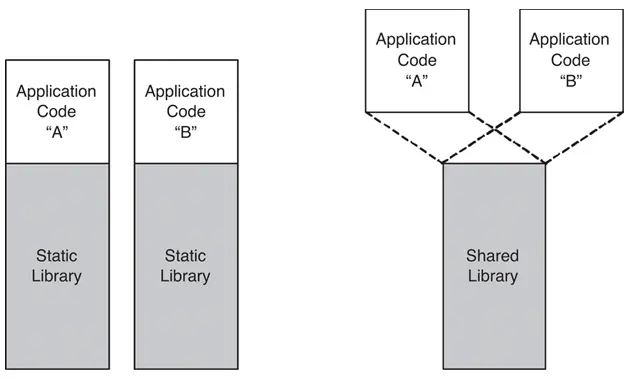

> 이미지 출처: https://medium.com/ai-innovation/a-guide-for-javascript-developers-to-build-c-add-ons-with-node-addon-api-28c84a0c0cb1

최근 Rust를 공부하면서 Rust 컴파일 파일이 Node.js Addon에 어떻게 연결되는지 궁금했다. 따라서 이번 기회에 N-API에 대해 "얕게" 알아보려고 한다.

이 글은 다음과 같은 내용을 다룬다.

1. Node-API란?
2. Node-API의 장점
3. Rust와 N-API를 사용한 Node.js Addon 개발

[N-API는 2021년 Node-API로 이름이 변경](https://medium.com/@nodejs/renaming-n-api-to-node-api-27aa8ca30ed8)되었다. 따라서 앞으로는 Node-API로 표기하겠다.

## Node-API란?


Node-API는 [Node.js v8에서 Stable로 소개](https://nodejs.org/docs/latest-v8.x/api/n-api.html#n_api_n_api)되었다.

Node-API는 Node.js 네이티브 Addon(C/C++)을 개발하기 위한 API이다. 기본 JavaScript 런타임(예: V8)과 독립적이며 Node.js 자체의 일부로 유지 관리되고 있다.

이 API는 Node.js의 모든 버전에서 [ABI 안정적](https://nodejs.org/en/learn/modules/abi-stability)이다.

> ABI(Application Binary Interface): 응용 프로그램이 컴파일된 이후에도 호환성을 유지하기 위한 인터페이스.

기본 JavaScript 엔진의 변경 사항으로부터 Addon을 보호하고 특정 버전에 대해 컴파일된 모듈을 재컴파일 없이 이후 버전의 Node.js에서 실행할 수 있도록 하는 것이 목적이다.

## Node-API의 장점


Node-API가 탄생한 배경을 이해하면 Node-API의 장점을 이해할 수 있다.

Node.js는 JavaScript를 브라우저 외부에서 실행시킬 수 있는 앱이다. 따라서 다양한 기능을 충족시키기 위해 C/C++ 네이티브 Addon을 통해 Node.js를 확장시키고자 하는 노력을 기울여 왔다.

이러한 노력은 유지보수의 어려움이 있었다. 내부적으로 의존하는 V8 엔진 및 Libuv 등은 지속적으로 업데이트되며 새로운 기능이 추가되거나 변경된다. 이러한 변화는 C/C++로 개발된 Addon의 ABI 안정성을 보장하기 어렵게 만들었다.

> Addon C++에서 V8에 직접 접근한 경우 Node.js는 안정성을 보장할 방법이 없기 때문.

또한 C/C++ Addon을 개발하고자 하는 개발자는 인터페이스 가이드를 받지 못하기 때문에 숙련된 개발자가 아니면 Addon을 적용하기가 어려웠다.

이러한 문제를 해결하기 위해 Node-API가 등장하게 되었다.

### 1. ABI 안정성

Node.js의 업데이트(내부 바인딩 디펜던시 라이브러리; V8 버전업 등)로 인해 Addon이 깨지는 문제를 해결한다.

### 2. 인터페이스 제공

Node-API는 C/C++ 개발자가 아니더라도 사용할 수 있도록 설계되었다.

주요 인터페이스를 제공하고 이를 통해 Node.js와 상호작용 할 수 있도록 한다.

> 인터페이스는 아래의 [Rust와 Node-API를 사용한 Node.js Addon 개발](#rust와-node-api를-사용한-nodejs-addon-개발)에서 간단하게 소개한다.

### 3. 최적화

C/C++ Addon을 특별한 바인딩 과정 없이 적용할 경우 직접 메모리 관리를 해야 했으며 멀티 스레딩도 스스로 구현해야 했다.

이는 Node.js와 V8, Libuv 등 다양한 바인딩 라이브러리들의 관계를 정확하게 알아야 하는 부담으로 다가왔다.

Node-API는 인터페이스를 통해 최적화해 주기 때문에 Addon 개발자에게 추가적인 부담을 주지 않는다.

## Rust와 Node-API를 사용한 Node.js Addon 개발

이제 Addon 개발 과정을 따라가면서 실체를 조금 더 자세히 이해해 보자.

개발 과정은 다음과 같다.

1. Node.js Addon 개발 환경 설정
2. Rust 파일을 목적 파일로 컴파일
3. 목적 파일을 Node.js Addon에 연결
4. JavaScript 파일에서 사용

### 1. Node-gyp 설치

```sh
$ npm i -g node-gyp
```

Node-API에서 제공하는 헤더, C 코드 등이 포함된 [node-gyp](https://github.com/nodejs/node-gyp)를 설치한다.

사전 파일이 포함된 `node-gyp`로 Addon을 빌드할 예정이기 때문에 [gcc](https://namu.wiki/w/GCC) 등의 컴파일러를 쓰지 않는다는 것을 확인할 수 있다.

### 2. Rust 파일을 목적 파일로 컴파일

```rs
// mycalc.rs
// rust_mul이라는 곱셈 함수를 export 할 예정.
#[no_mangle]
pub extern "C" fn rust_mul(a: isize, b: isize) -> isize {
  a * b
}
```

```sh
# compile
$ rustc --crate-type="dylib" mycalc.rs -o libmycalc.so
```

Rust 코드로 작성된 `rust_mul` 함수를 `libmycalc.so` 파일로 컴파일한다.

해당 함수를 Node-API를 통해 C Addon으로 가져와 JavaScript 모듈에서 사용할 수 있도록 할 예정이다.



`.so`(Shared Objects) 파일은 컴파일 단계에서 코드 영역에 추가되지 않고 런타임에 동적으로 로드되는 라이브러리이다.

### 3. binding.gyp 파일 생성

```json
// binding.gyp
{
  "targets": [
    {
      "target_name": "mycalc_addon",
      "sources": ["mycalc_addon.c"],
      "libraries": [
        "/PATH/libmycalc.so" // 동적 로딩을 사용하기 위해 추가(Rust 파일을 컴파일한 파일)
      ]
    }
  ]
}
```

`node-gyp`를 사용해 빌드할 때 필요한 설정 파일인 `binding.gyp`를 작성한다.

`mycalc_addon.c` 파일은 Node-API를 사용해 C Addon을 작성할 파일이다.

### 4. Addon C 파일 작성

```c
// mycalc_addon.c
// node_api를 가져오는 모습(node-gyp에 있을 것이므로 사용할 수 있다)
#include <node_api.h>
#include <stdio.h>
// Rust 파일의 함수를 C로 가져온다(so 파일에 있을 예정)
int rust_mul(int a, int b);
// 두 숫자를 더하는 C 함수
napi_value Mul(napi_env env, napi_callback_info info) {
  napi_status status;
  // 인자 개수와 인자 배열
  size_t argc = 2;
  napi_value argv[2];
  status = napi_get_cb_info(env, info, &argc, argv, NULL, NULL);
  if (status != napi_ok) {
    napi_throw_error(env, NULL, "Failed to parse arguments");
    return NULL;
  }
  // 인자가 2개인지 확인
  if (argc < 2) {
    napi_throw_error(env, NULL, "Wrong number of arguments");
    return NULL;
  }
  // 인자를 double로 변환. JavaScript와 C++의 다른 타입을 일치시킨다
  double value1, value2;
  status = napi_get_value_double(env, argv[0], &value1);
  if (status != napi_ok) {
    napi_throw_error(env, NULL, "Invalid argument 1");
    return NULL;
  }
  status = napi_get_value_double(env, argv[1], &value2);
  if (status != napi_ok) {
    napi_throw_error(env, NULL, "Invalid argument 2");
    return NULL;
  }
  // rust 모듈을 활용해 결과 계산 //////////////////////////////////////////////
  double result = rust_mul(value1, value2);
  // rust 모듈의 결과를 napi_value로 변환
  napi_value result_value;
  status = napi_create_double(env, result, &result_value);
  if (status != napi_ok) {
    napi_throw_error(env, NULL, "Failed to create result value");
    return NULL;
  }
  // 결과 반환
  return result_value;
}
// 모듈 초기화 함수
napi_value Init(napi_env env, napi_value exports) {
  napi_status status;
  // 함수 등록
  napi_value fn;
  status = napi_create_function(env, NULL, 0, Mul, NULL, &fn);
  if (status != napi_ok) {
    napi_throw_error(env, NULL, "Failed to create function");
    return NULL;
  }
  // exports 객체에 함수 추가. 이로써 JavaScript에서 사용 가능해진다! ////////
  status = napi_set_named_property(env, exports, "mul", fn);
  if (status != napi_ok) {
    napi_throw_error(env, NULL, "Failed to set named property");
    return NULL;
  }
  return exports;
}
// 모듈 등록
NAPI_MODULE(NODE_GYP_MODULE_NAME, Init)
```

`napi`로 시작하는 함수들은 Node-API에서 제공하는 함수이다.

위의 코드를 모두 이해할 필요는 없다. Node-API를 사용해 C Addon을 작성하는 방법을 보여주기 위한 코드이다.

중요한 점은 Rust의 `rust_mul` 함수를 C로 가져와 `Mul` 함수에서 사용하고 있다는 점이다.

### 5. Addon 빌드

```sh
$ node-gyp configure && node-gyp build
```

`node-gyp`를 사용해 Addon을 빌드한다.


`build` 명령어를 실행하면 `build/Release` 디렉터리에 `mycalc_addon.node` 파일이 생성된다.

> `.node` 파일은 Node.js Addon을 의미한다.

### 6. JavaScript 파일에서 사용하기

```js
// index.js
const addon = require('./build/Release/mycalc_addon');
console.log(addon.mul(3, 5)); // 15 출력
```

TA-DA! JavaScript 파일에서 C Addon을 사용하고 있다.

이로써 Rust(`rust_mul`) \<-> C(`Mul`) \<-> Node.js(`mul`) 간의 연결이 완료되었다.

## 마치며

Rust와 Node-API를 사용해 Node.js Addon을 개발하면서 Addon 및 적용 과정을 이해할 수 있었다.

글을 요약하면 다음과 같다.

1. N-API는 Node-API 를 의미한다.
2. Node-API를 활용해 JS 레이어를 거치지 않는, 고속 라이브러리를 만들 수 있다.
3. 바이너리 코드로 통합되므로 FFI([외부 함수 인터페이스](https://ko.wikipedia.org/wiki/%EC%99%B8%EB%B6%80_%ED%95%A8%EC%88%98_%EC%9D%B8%ED%84%B0%ED%8E%98%EC%9D%B4%EC%8A%A4); 다른 언어 호출)가 가능하다.

Node.js의 내부에 한층 더 깊게 파고들어 간 것 같아 뿌듯하다.

이 글을 통해 Node.js Addon 개발에 흥미가 생겼길 바라며 마무리 하겠다.

## 참고

- https://nodejs.org/docs/latest/api/addons.html
- https://medium.com/ai-innovation/a-guide-for-javascript-developers-to-build-c-add-ons-with-node-addon-api-28c84a0c0cb1
- https://nodeaddons.com/how-not-to-access-node-js-from-c-worker-threads
