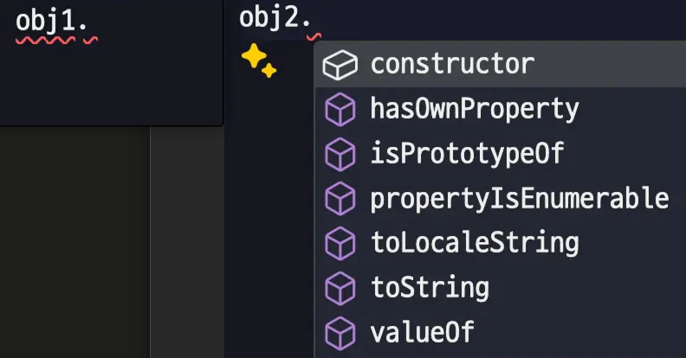

문자열 리터럴 타입의 확장을 알아보던 도중 객체 타입의 이해가 필요하다는 생각이 들었다.

따라서 이번 글에서는

1. 문자열 리터럴 타입을 확장하는 방법
2. `Object`, `object`, `{}` 타입의 차이점

두 가지를 다뤄보려고 한다.

## TL;DR

| 타입 | 원시 타입 허용 | 객체 허용 | 기본 객체 메서드 | null, undefined |
| --- | --- | --- | --- | --- |
| Object | ✅ | ✅ | ✅ | ❌ |
| object | ❌ | ✅ | ❌ | ❌ |
| \{} | ✅ | ✅ | ❌ | ❌ |

## 의문

```ts
type StringHint = 'foo' | 'bar' | string // foo, bar 힌트가 보이지 않음.
type StringHint = 'foo' | 'bar' | (string & {}) // foo, bar 힌트가 보이면서 문자 입력 가능.
```


> 문자열 리터럴과 (string & \{})의 유니온으로 리터럴 힌트 및 문자 확장이 가능한 모습

위와 같은 패턴은 라이브러리 개발때 자주 보인다. 라이브러리를 사용하는 개발자에게 <u>특정 값이 있음을 안내하면서, 그 외의 커스텀한 값이 들어와도 될 경우</u> 특히 유용하다.

왜 이러한 차이가 나타나는 걸까?

첫 번째 예(`'foo' | 'bar' | string`)는 쉽게 유추할 수 있다. `string` 타입이 문자열 리터럴 타입보다 넓기 때문에 스트링 타입의 서브셋인 문자열 리터럴이 잡아먹힌 상황이다.

- `"Hello World"`는 `string` 타입이지만 `string`은 `"Hello World"`가 아니다.
- 따라서 더 넓은 범위인 `string` 타입으로 추론된다.

그렇다면 두 번째의 `string & {}`는 무엇일까?

## string & \{}

```ts
type Test = 'foo' | 'bar' | string extends string ? true : false; // true
type Test = 'foo' | 'bar' | (string & {}) extends string ? true : false; // true
```

`string & {}`는 `string`과 `{}`의 교집합이다.

<u>`{}`는 대부분의 타입을 포함하는 타입이므로(후술)</u>, `string`과 교집합을 구하면 결국 `string` 타입과 동일하게 동작하게 된다.

그런데 문자열 리터럴(`"foo", "bar"`)은 `string`의 서브셋이지 `string & {}`의 서브셋이 아니다(!).

`string & {}`이 <u>구체적인 타입</u>인 `string`으로 좁혀지지 않았기 때문에 타입스크립트 컴파일러는 해당 타입을 문자열 리터럴과 다른 타입으로 간주하게 된다.

이러한 특성 때문에 우리는 문자열 리터럴을 사용하면서 문자열을 확장할 수 있게 된다.

> 관련 내용은 타입스크립트 이슈([Literal String Union Autocomplete #29729](https://github.com/microsoft/TypeScript/issues/29729#issuecomment-567871939))에서 확인할 수 있다.

### 구체적인 타입

타입스크립트의 타입 시스템은 [구조적 서브 타이핑](/posts/typescript-subtyping#%EA%B5%AC%EC%A1%B0%EC%A0%81-%EC%84%9C%EB%B8%8C-%ED%83%80%EC%9D%B4%ED%95%91%EC%9D%B4%EB%9E%80)을 따른다. 그렇기에 각 타입을 구조적으로 비교한다.

이때 교집합(`&`)을 사용하면 더 구체적인 타입으로 나타낼 수 있다.

```ts
type A = { a: string };
type B = { a: 'A' | 'B'; b: number };
type ANB = A & B; // { a: 'A' | 'B', b: number };
```

구조적 서브 타이핑에 익숙하지 않으면 위의 예에서 "중첩"만 생각해 중첩되는 `'a'` 프로퍼티만 가져와 `A & B = { a: 'A' | 'B' }`로 생각할 수 있다. 하지만 <u>`A & B`의 의미는 `A`와 `B` 타입 모두를 만족하는 타입</u><ExternalAnchor href="https://www.typescriptlang.org/docs/handbook/unions-and-intersections.html#intersection-types" />을 의미한다.

집합적 관점에서 생각해보자. `x ∈ A ∩ B`일 필요충분조건은 `x ∈ A` 혹은 `x ∈ B` 이다<ExternalAnchor href="https://ko.wikipedia.org/wiki/%EA%B5%90%EC%A7%91%ED%95%A9" />.

> \{★, ●}, \{★, ●, ◆}의 교집합은 \{★, ●}이다. 교집합은 부모와 같아질 수 있다.

```ts
type Test1 = ANB extends A ? true : false; // true
type Test2 = ANB extends B ? true : false; // true
```

그렇다면 위의 논리로 `ANB`를 살펴보자. `ANB`는 `A`와 `B`의 구체적인 타입(교집합)이므로 `ANB`는 `A` 혹은 `B`로 간주될 수 있어야 한다.

`A & B` 타입이 `A` 타입이 되려면 `{ a: string }`을 만족해야 하며 `B` 타입이 되기 위해선 `{ a: 'A' | 'B', b: number }`를 만족해야 한다.

이를 구조적으로 표현하기 위해서 `A & B`는 `A`와 `B`의 모든 속성을 가져오고 속성이 겹친다면 가장 좁은 타입을 적용하게 된다.

> \{ a: string, b: number } 타입은 A는 만족하지만 B는 만족하지 않기 때문.

아래 예제를 보면 더 명확해진다.

```ts
type A = { a: string };
type B = { a: 'A' | 'B'; b: number };
type ANB = A & B; // { a: 'A' | 'B', b: number };

const a = { a: 'Astring' };
const aa = { a: 'Astring', b: 1 };
// 타입 B의 a 프로퍼티가 'A' | 'B' 타입이므로 더 좁은 타입으로 강제 지정해줘야 함.
const b = { a: 'B' as 'A' | 'B', b: 2 };
const bb = { a: 'B' as 'A' | 'B', b: 2, c: 'ddd' };

const goA = (param: A) => console.log(param);
const goB = (param: B) => console.log(param);
const goANB = (param: ANB) => console.log(param);

goA(a); // OK
goA(aa); // OK. 타입에 없는 b 프로퍼티가 추가되어도 a가 있으므로 "구조적으로" 상관없음.

goB(b); // OK
goB(bb); // OK

goANB(a); // Error. b 프로퍼티가 없음.
goANB(aa); // Error. a 프로퍼티의 타입이 구조적으로 맞지 않음(넓음).
goANB(b); // OK
goANB(bb); // OK. c 프로퍼티가 추가되어도 a, b가 있으므로 "구조적으로" 상관없음.
```

요구하는 타입의 구조만 만족한다면 그 외의 속성이 있어도 타입 에러가 발생하지 않는 것을 확인할 수 있다.

따라서 `ANB`는  `A`의 모든 속성과 `B`의 모든 속성을 가져온 타입이 된다.

```ts
type Test1 = 'foo' extends string ? true : false; // true
type Test2 = 'foo' & string extends string ? true : false; // true
type Test3 = 'foo' & {} extends string ? true : false; // true
type Test4 = string & {} extends string ? true : false; // true
```

위에서 다뤘던 문자열 리터럴 `'foo'`는 `string`의 구체적인 타입이다. 그렇기 때문에 문자열 리터럴 `'foo'`가 `string`으로 간주되어도 문제가 없다(더 넓은 타입).

이러한 구조적 서브 타이핑의 논리에 따라 `string & {}`는 실질적으로 `string`과 동일한 의미여도 `string`보다 더 구체적인 "타입"으로 정의된다.

이는 `string`과는 다른 타입이므로 문자열 리터럴과 유니온 타입을 지정할 때 `string`으로 잡아먹히지 않게 된다.

## Object vs object vs \{}

앞에서 "`{}`는 대부분의 타입을 포함하는 타입"이라고 했다. 그렇다면 객체의 최상위 타입인 `Object`, `object`, `{}`는 어떤 차이가 있을까?

이를 자세히 알기 위해선 자바스크립트의 타입을 이해해야 한다.

### 자바스크립트의 타입

```shell
[모든 값]
├── [원시 타입 (Primitive Types)]
│   ├── undefined
│   ├── null
│   ├── boolean
│   ├── number
│   ├── string
│   ├── symbol (ES6+)
│   └── bigint (ES2020+)
└── [객체 타입 (Object Types)]
    ├── 객체 (Object)
    │   ├── 일반 객체 (Plain Object)
    │   ├── 배열 (Array)
    │   ├── 함수 (Function)
    │   ├── 날짜 (Date)
    │   ├── 정규식 (RegExp)
    │   └── 기타 내장 객체 (Map, Set, Promise 등)
    └── 래퍼 객체 (Wrapper Objects)
        ├── Boolean
        ├── Number
        ├── String
        ├── Symbol
        └── BigInt
```

자바스크립트는 7개의 원시 타입과 Object 객체 타입을 포함해 총 8개의 타입으로 구분된다.


### 원시 타입과 객체 타입

| 원시 타입 | 객체 타입 |
| --- | --- |
| 값이 메모리에 직접 저장 | 힙 메모리에 저장 |
| 변수는 값 자체를 저장 | 변수는 값의 참조(주소)를 저장한다 |
| 불변 | 가변 |
| `let a = 10`: `a`는 `10`이라는 값을 직접 저장 | `let b = {...}`: `b`는 객체의 참조 값 저장 |

> 여기서 불변 가변은 let, const가 아닌 메모리에 저장되는 값의 변경 여부를 의미한다.

자바스크립트 타입을 기준으로 `object`는 원시 타입을 제외한 모든 객체 타입을 의미한다.

### Object 타입

```ts
const obj1: Object = { a: 1 }; // OK. new Object({ a: 1 })
const obj2: Object = 'hello'; // OK. 원시 타입도 허용
const obj3: Object = 123; // OK. 원시 타입도 허용
const obj4: Object = null; // Err. null은 허용되지 않음(래퍼 객체 없음)
const obj5: Object = undefined; // Err. undefined는 허용되지 않음(래퍼 객체 없음)
const obj6: Object = () => {}; // OK. 함수는 객체를 상속한다.
const obj7: Object = []; // OK. 배열도 객체를 상속한다.
```

`Object` 타입은 자바스크립트의 `Object` 생성자 함수를 통해 생성된 객체를 나타내는 타입이다.

`Object` 생성자 함수는 모든 객체의 부모이다. `null`과 `undefined`는 래퍼 객체가 없기 때문에 Object 생성자로 만들 수 없다.

따라서 `Object` 타입은 `null`, `undefined`를 제외한 모든 값을 나타낸다.

모든 객체 타입인데 어째서 원시 타입이 허용되는 것일까? 이는 자바스크립트의 래퍼 객체 때문이다.

```ts
let str = "hello";
// 원시 타입은 "값"이므로 메서드를 호출할 수 없다. 그럼에도 아래의 코드가 동작한다.
console.log(str.toUpperCase()); // "HELLO"
// 실제 런타임 상황에선 아래와 같이 래퍼 객체의 도움을 받는다.
console.log(String(str).toUpperCase()); // "HELLO"
```

자바스크립트는 원시 타입을 객체처럼 다루기 위해 래퍼 객체를 제공한다. 따라서 `Object` 타입은 원시 타입을 포함한 모든 객체 타입을 나타내게 된다.

타입스크립트 가이드는 이러한 래퍼 객체를 직접 사용하는 것을 [권장하지 않는다](https://www.typescriptlang.org/docs/handbook/declaration-files/do-s-and-don-ts.html#general-types).

### object 타입

```ts
const obj1: object = { a: 1 }; // OK. new Object({ a: 1 })
const obj2: object = 'hello'; // Err. 원시 타입 허용되지 않음
const obj3: object = 123; // Err.
const obj4: object = null; // Err.
const obj5: object = undefined; // Err.
const obj6: object = () => {}; // OK.
const obj7: object = []; // OK.
```

`object` 타입은 [원시 타입이 아닌 모든 값을 나타낸다](https://www.typescriptlang.org/docs/handbook/release-notes/typescript-2-2.html#object-type).

> object 타입은 타입스크립트 2.2 버전에서 추가되었다.

위에서 살펴본 자바스크립트의 타입을 기준으로 보면 원시 타입이 아닌 모든 값은 곧 객체 타입이다. 따라서 `object` 타입은 원시 타입을 제외한 모든 객체 타입을 나타낸다.

### \{\} 타입

```ts
const obj1: {} = { a: 1 }; // OK. new Object({ a: 1 })
const obj2: {} = 'hello'; // OK. 원시 타입을 허용함.
const obj3: {} = 123; // OK.
const obj4: {} = null; // Err. Object 타입과 동일하게 래퍼 객체가 없으므로 허용되지 않음.
const obj5: {} = undefined; // Err.
const obj6: {} = () => {}; // OK.
const obj7: {} = []; // OK.
```

자바스크립트에서 `{}`는 빈 객체를 의미하지만 타입스크립트에서 `{}`는 0개 이상의 속성(properties)을 가진 모든 [Nullish](https://developer.mozilla.org/en-US/docs/Glossary/Nullish) 하지 않은 값에 해당한다.

이 뜻은 `Object`, `object`와는 다르게 `{}`는 객체 타입만을 의미하지 않는다는 것이다. 이는 곧 객체만 가지고 있는 `hasOwnProperty` 메서드를 포함하지 않는다는 의미이다.

> 타입스크립트 공식 FAQ - [#Primitives are \{}, and \{} Doesn't Mean object](https://github.com/microsoft/TypeScript/wiki/FAQ#primitives-are---and---doesnt-mean-object).
>
> 해당 FAQ를 보면 [원시 타입](/posts/implicit-coercion#%EB%93%A4%EC%96%B4%EA%B0%80%EA%B8%B0-%EC%A0%84%EC%97%90)은 `{}`이며 `{}`는 object 타입을 의미하지 않는다고 한다.

```ts
const obj1: {} = { a: 1 };
const obj2: Object = 'hello';
```



> (좌) \{} 타입은 hasOwnProperty 메서드를 보여주지 않는다. (우) Object 타입은 hasOwnProperty 메서드를 포함한다.

### 정리

| 타입 | 원시 타입 허용 | 객체 허용 | 기본 객체 메서드 | null, undefined |
| --- | --- | --- | --- | --- |
| Object | ✅ | ✅ | ✅ | ❌ |
| object | ❌ | ✅ | ❌ | ❌ |
| \{} | ✅ | ✅ | ❌ | ❌ |

- `Object`: 자바스크립트의 `Object` 생성자 함수를 통해 생성된 객체를 나타내는 타입. 원시 타입을 포함한 모든 객체 타입을 나타낸다.
- `object`: 원시 타입을 제외한 모든 객체 타입을 나타낸다.
- `{}`: 0개 이상의 속성(properties)을 가진 모든 [Nullish](https://developer.mozilla.org/en-US/docs/Glossary/Nullish) 하지 않은 값에 해당한다.

위의 표와 같이 `Object`, `object`, `{}`는 각각 다른 의미로 서로를 보완하고 있다. 이를 이해하면 타입스크립트에서의 객체 타입을 더 정확하게 사용할 수 있다.

```ts
type A = 'A' | 'B' | (string & Object);
type AA = 'A' | 'B' | (string & {});
type AAA = 'A' | 'B' | (string & object);
```

이제 우리는 위의 타입이 어떤 의미를 가지는지 이해할 수 있다.

- `A`
  - 문자열 리터럴 타입을 확장하면서 문자열을 입력할 수 있게 한다.
  - 단, `Object` 타입을 가져오므로 `hasOwnProperty` 메서드와 같은 객체 기본 메서드를 포함한다.
- `AA`
  - 위와 동일하지만 `Object` 타입이 아닌 `{}` 타입을 확장한다.
  - 이는 `String` 래퍼 객체까지만의 확장을 의미한다. 즉, `hasOwnProperty` 메서드를 포함하지 않는다.
  - 따라서 문자열 리터럴 타입을 확장하면서 문자열을 입력할 때 가장 적절한 타입이다.
- `AAA`
  - 문자열 확장이 불가능하다.
  - `object`는 객체 타입만을 의미하므로 원시 타입인 `string`과 교집합이 없다.
  - 이는 `never` 타입이 된다.

## 마치며

각 타입을 비교하면서 객체에 대한 이해도가 높아질 수 있었다.

```ts
type EmptyObject = Record<string, never>; // {} 대신 사용.
```

실제로 객체 타입을 정의할 때에는 `Record` 타입과 같은 유틸리티 타입을 사용하는 것이 좋다. 이는 타입스크립트의 타입 추론을 돕고, 코드의 가독성을 높여준다.

이 글이 흥미로웠다면 [Object.keys()는 왜 string[] 타입일까?](/posts/typescript-subtyping)도 읽어보길 추천한다. 이 글은 타입스크립트의 구조적 서브 타이핑에 대한 이해를 돕는다.

## 참고

- https://stackoverflow.com/questions/18961203/any-vs-object
- https://stackoverflow.com/questions/49464634/difference-between-object-and-object-in-typescript
- [알랑말랑 암묵적 형변환 말랑말랑 이해하기](/posts/implicit-coercion)
- https://www.reddit.com/r/typescript/comments/1e61bla/demystifying_intersection_and_union_types_in/
- https://ivov.dev/notes/typescript-and-set-theory
- https://blog.hwahae.co.kr/all/tech/9954
