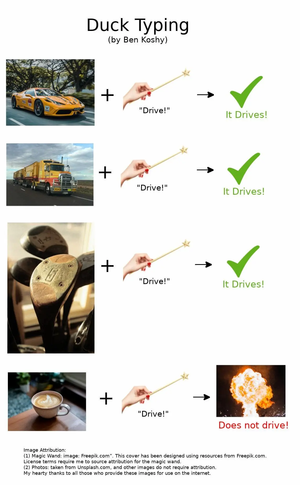

## Index

- [TL;DR!](#tldr)
- [문제](#문제)
- [구조적 서브 타이핑이란](#구조적-서브-타이핑이란)
- [해결](#해결)
- [마무리](#마무리)
- [One more thing](#one-more-thing)
- [참고](#참고)

## TL;DR!

타입스크립트는 자바스크립트의 덕 타입을 표현하기 위해 구조적 서브 타이핑을 채택하고 있다.

`Object.keys()`는 런타임에서의 안정성을 위해 넓은 타입인 `string[]` 타입으로 추론된다.

## 문제

```ts {12}
interface MyObject {
  first: number;
  second: string;
  third: boolean;
}
const parseMyObject = (object: MyObject) => {
  const parsed = { accNum: 0, trueCount: 0 };

  Object.keys(object).forEach((key) => {
    // 🚨 Element implicitly has an 'any' type because expression of type 'string' can't be used to index type 'MyObject'.
    // No index signature with a parameter of type 'string' was found on type 'MyObject'.(7053)
    const curValue = object[key];
    if (!isNaN(curValue)) {
      parsed.accNum += curValue;
    } else if (curValue === true) {
      parsed.trueCount++;
    }
  });
  return parsed;
};
```

개발을 하다 보면 자연스럽게 객체를 많이 사용하게 된다. 이때 [Object.keys](https://developer.mozilla.org/ko/docs/Web/JavaScript/Reference/Global_Objects/Object/keys) 메서드를 사용하면 항상 `key` 값이 `string`으로 추론되는 것을 확인할 수 있다.

```ts
const keyList = Object.keys(obj) as Array<keyof typeof obj>;
```

`string`으로 [타입 추론(Type Inference)](https://www.typescriptlang.org/docs/handbook/type-inference.html) 되었기 때문에 이후 코딩의 편의성을 위해 다시 [타입 단언(Type Assertion)](https://www.typescriptlang.org/docs/handbook/2/everyday-types.html#type-assertions)을 하게 된다.

단언을 통한 타입 제어가 마음을 불편하게 하기 때문에 [제너릭 타입](https://www.typescriptlang.org/ko/docs/handbook/2/generics.html)으로라도 추론하고 싶어 진다.

```ts title="TypeScript/src/lib/es2015.core.d.ts"
interface ObjectConstructor {
  keys(o: {}): string[];
}
```

하지만 타입스크립트는 [Object.keys\<T\>() 제너릭 타입을 제공하지 않는다](https://github.com/microsoft/TypeScript/blob/36ac4eb700ce596033762b821545753753d13444/src/lib/es2015.core.d.ts#L301-L305).

여기서 의문이 생긴다.

- 기존의 key 타입을 왜 추론하지 못할까?
- 제너릭 타입은 왜 제공하지 않았을까?

오늘은 타입스크립트를 사용하면서 만나는 미묘한 당혹스러움에 대해 파헤쳐 보고자 한다.

## 구조적 서브 타이핑이란

앞에서 다룬 문제의 이유는 [타입스크립트가 구조적 서브 타이핑을 기반](https://www.typescriptlang.org/docs/handbook/type-compatibility.html)으로 하고 있기 때문이다.

이전에 [우아한 타입스크립트](/posts/woowa-type-review#%ED%83%80-%EC%96%B8%EC%96%B4%EC%9D%98-%ED%83%80%EC%9E%85-%EC%8B%9C%EC%8A%A4%ED%85%9C%EA%B3%BC-%EB%B9%84%EA%B5%90)에서 구조적 타이핑을 잠깐 이야기한 적이 있었다.



> Image Source: [What is duck typing](https://stackoverflow.com/questions/4205130/what-is-duck-typing)

자바스크립트는 [덕 타이핑](https://ko.wikipedia.org/wiki/%EB%8D%95_%ED%83%80%EC%9D%B4%ED%95%91)을 기반으로 하는 [동적 타이핑](https://developer.mozilla.org/ko/docs/Glossary/Dynamic_typing) 언어이다.

따라서 타입스크립트는 자바스크립트의 특성(유연한 동적 타입)을 해치지 않으면서 타입을 강제([정적 타이핑](https://developer.mozilla.org/ko/docs/Glossary/Static_typing))하기 위한 고민을 하게 된다.

```ts
type Book = {
  name: string;
};
```

위와 같은 객체 타입 `Book`을 선언하게 되면 일반적인 [명목적 타입 시스템](https://ko.wikipedia.org/wiki/%EB%AA%85%EB%AA%A9%EC%A0%81_%EC%9E%90%EB%A3%8C%ED%98%95_%EC%B2%B4%EA%B3%84)에서는 반드시 `Book { name: string }` 형태의 타입만 와야 한다.

```ts
const getName = (book: Book) => {
  return book.name;
};

const book1 = { name: '123' };
const book2 = { name: '123', model: 'wow' };
const book3 = { name: '123', model: 'wow', wow: 'line' };

getName(book1); // OK
getName(book2); // OK
getName(book3); // OK
```

하지만 타입스크립트에서는 위와 같은 모든 형태의 객체가 가능하다. 이것이 바로 구조적 서브 타이핑이다.

구조적 타입 시스템의 주요 특성은 <u>**값을 할당할 때 정의된 타입에 필요한 속성을 가지고 있다면 호환된다**</u>는 것이다.

따라서 구조적 타입 시스템에서 타입은 <u>값의 집합</u>으로 생각하면 된다.

그렇다면 구조적 서브 타이핑과 `Object.keys`의 반환 타입에는 어떤 연관이 있는 것일까?

```ts
class MyObject {
  // https://stackoverflow.com/questions/49464634/difference-between-object-and-object-in-typescript
  // object 타입은 원시 타입을 제외한 모든 값이 될 수 있다.
  keys<T extends object>(o: T): (keyof T)[];
}
const keys = MyObject.keys<Book>(book1); // "name"[]
const keys = MyObject.keys<Book>(book2); // "name"[]
const keys = MyObject.keys(book3); // ("name" | "model" | "wow")[]
```

자바스크립트의 덕 타입 덕에 객체는 런타임 단계에서 더 많은 속성을 가질 수 있다. 또한 구조적 서브 타이핑은 필요한 속성을 가지고 있다면 확장된 집합과 호환되며 에러를 노출하지 않는다.

그렇기 때문에 타입스크립트는 객체 인자에 **`T` 타입의 값만 존재한다는 보장을 할 수 없다**.

```ts
for (const key of Object.keys(book1)) {
  // 🚨 No index signature with a parameter of type 'string' was found on type 'Book'.(7053)
  const value = book1[key];
}
```

따라서 타입스크립트는 런타임에서의 안정성을 찾기 위해 좁은 타입의 `(keyof T)[]`가 아닌 넓은 타입인 `string[]`으로 추론한다.

관련 논의는 [#12253](https://github.com/microsoft/TypeScript/pull/12253#issuecomment-263132208) 이슈 코멘트에서 확인할 수 있다.

- [글의 말미](/posts/typescript-subtyping#one-more-thing)에서 구조적 서브 타이핑에 대해 더 다루도록 하겠다.

## 해결

이제 타입스크립트가 `Object.keys`의 값을 `string[]`으로 추론하는 이유를 확인했다.

이를 타입 단언을 사용하지 않고 추론하려면 어떻게 해야 할까?

### 타입 가드를 통한 타입 좁히기

```ts
const book: Book = { name: '123' };
const book3 = { name: '123', model: 'wow', wow: 'line' };

// 타입 좁히기
const isBook = (key: string): key is keyof Book => {
  return Object.keys(book).includes(key);
};

for (const key of Object.keys(book3)) {
  // 타입 가드로 타입이 존재하는 컨디션 블록이 생기게 됨
  if (isBook(key)) {
    // Book 타입의 키
  } else {
    // 구조적 서브 타이핑으로 확장된 키
  }
}
```

[타입 가드(Type Guards)](https://www.typescriptlang.org/docs/handbook/2/narrowing.html#typeof-type-guards)를 통한 [타입 좁히기(Type Narrowing)](https://www.typescriptlang.org/docs/handbook/2/narrowing.html#using-type-predicates)를 활용하면 타입 단언을 하지 않아도 적절하게 타입을 추론할 수 있게 된다.

무엇보다 <u>런타임에서도 안전한 코드로 변화</u>했다.

## ONE MORE THING

```ts
type Book = { name: string };
type Car = { model: string };

const BookOrCar = {} as Book | Car;
// 🚨 Property 'name' does not exist on type 'BookOrCar'.
// Property 'name' does not exist on type 'Car'.(2339)
BookOrCar.name;
// 🚨 Property 'model' does not exist on type 'BookOrCar'.
// Property 'model' does not exist on type 'Book'.(2339)
BookOrCar.model;

const BookAndCar = {} as Book & Car;
BookAndCar.name; // string
BookAndCar.model; // string

type A = 'A';
type B = 'B';

type AorB = A | B; // 'A' | 'B'
type AandB = A & B; // never
```

구조적 서브 타이핑을 조금 더 알아보자.

`Book` 타입과 `Car` 타입이 [유니온](https://www.typescriptlang.org/docs/handbook/2/everyday-types.html#union-types) 혹은 [교차](https://www.typescriptlang.org/docs/handbook/2/objects.html#intersection-types) 될 때 타입 추론이 혼란스러운 부분이 있다.

`BookOrCar`는 `{ name: string }` 혹은 `{ model: string }` 타입이 되기 때문에 두 값이 공존해야 한다고 느껴진다. 하지만 타입스크립트는 두 값 모두 추론하지 못한다.

반대로 교차 타입은 `BookAndCar`에서는 모든 값을 가지지만 `AandB`에서는 `never` 타입이 추론된다.


앞에서 "구조적 타입 시스템에서의 타입은 <u>값의 집합</u>으로 생각하면 된다"고 했다.

각 타입을 값의 집합으로 나열해 보자.

```json title="Book 타입에 충족되는 값의 집합"
{ name: "123" };
{ name: "123", model: "wow" };
{ name: "123", model: "wow", wow: "line" };
그 외 `name`이 존재하는 객체
```

```json title="Car 타입에 충족되는 값의 집합"
{ model: "wow" };
{ name: "123", model: "wow" };
{ name: "123", model: "wow", wow: "line" };
그 외 `model`이 존재하는 객체
```

```json title="Book | Car 타입의 모든 값의 집합"
{ name: "123" };
{ name: "123", model: "wow" };
{ name: "123", model: "wow", wow: "line" };
그 외 `name`이 존재하는 객체
{ model: "wow" };
{ name: "123", model: "wow" };
{ name: "123", model: "wow", wow: "line" };
그 외 `model`이 존재하는 객체
```

`Book | Car`의 경우에 Book 혹은 Car 중 <u>"항상 존재하는 값"이 없는 것</u>을 확인(`name` 혹은 `model`이 반드시 있어야 하는 경우가 없음) 할 수 있다.

```json title="Book & Car 타입의 모든 값의 집합"
{ name: "123", model: "wow" };
{ name: "123", model: "wow", wow: "line" };
```

반면 `Book & Car`의 경우 "항상 존재하는 값"이 있는 것을 확인할 수 있다.

### 결론

따라서 `Book | Car`에서는 항상 존재하는 값이 없기 때문에 `name`, `model` 어느 값도 존재하지 않게 되지만 `Book & Car`에서는 `name`, `model` 모두 항상 존재하기 때문에 두 값 모두 존재하게 된다.

## 마무리

타입스크립트를 사용하면서도 언어의 근본적인 철학을 이해하지 못한 상태로 작업한 것 같아 반성하게 되는 계기였다.

타입을 사용하면서 지금처럼 당혹스러운 부분이 있었는데 이번 기회에 많이 이해할 수 있었다.

## 참고

- [Type Compatibility](https://www.typescriptlang.org/ko/docs/handbook/type-compatibility.html)
- [[번역] 왜 타입스크립트는 Object.keys의 타입을 적절하게 추론하지 못할까요?](https://medium.com/@yujso66/번역-왜-타입스크립트는-object-keys의-타입을-적절하게-추론하지-못할까요-477253b1aafa)
- [Why Object.keys Returns an Array of Strings in TypeScript (And How To Fix It)](https://www.mattstobbs.com/object-keys-typescript/)
- [타입스크립트의 구조적 타이핑](https://www.yongdam.sh/blog/effective-typescript-structural-typing)
- [Object.keys() types refinement, and Object.entries() types bugfix #12253](https://github.com/microsoft/TypeScript/pull/12253#issuecomment-263132208)
