{(globalThis.slug = 'mac-init-apps') && ''}


최근 기기 변경을 하면서 맥 세팅을 처음부터 할 일이 있었다. 그때 꽤 고생한 기억이 있어 이번 기회에 유용했던 것들을 한번 정리해 보려고 한다.

웹 개발자를 위한 도구 추천 포스트는 3가지 시리즈로 연재 될 예정이다.

1. 유용한 Mac 앱
2. VSCode 익스텐션
3. 크롬 익스텐션

직접 사용하면서 유용했던 것들을 모아놓았기 때문에 안정성 문제는 없을 것으로 생각된다.

## 모아보기

- [Chrome](#chrome)
- [Homebrew](#homebrew)
- [Oh My Zsh](#oh-my-zsh)
- [Iterm2](#iterm2)
- [VSCode](#vscode)
- [NeoVim](#neovim)
- [D2Coding](#d2-coding)
- [Node.js](#nodejs)
- [NVM](#nvm)
- [Docker](#docker)
- [GIPHY Capture](#giphy-capture)
- [DeepL](#deepl)
- [ScreenHint](#screenhint)
- [Quick Notes](#quick-notes)
- [Calculator Pro](#calculator-pro)
- [올ㅋ사전](#올ㅋ사전)
- [CodeWhisperer](#codewhisperer)
- [Flycut](#flycut)
- [ScreenBrush](#screenbrush)
- [Keycastr](#keycastr)
- [Ngrok](#ngrok)
- [Hidden bar](#hidden-bar)
- [Digital Color Meter](#digital-color-meter)

## Chrome


소개 문구에서부터 포스가 장난 아니다. 테스팅 환경 때문이라도 필요한 웹 브라우저 크롬이다.

다음에 연재할 크롬 익스텐션 섹션을 통해 크롬이 얼마나 강력한지 후술하고자 한다.

- [만약 크롬이 실행 되지 않는다면](https://support.google.com/chrome/thread/64580550?hl=ko&msgid=68816629)

> [다운로드 링크](https://www.google.com/chrome)

## Homebrew

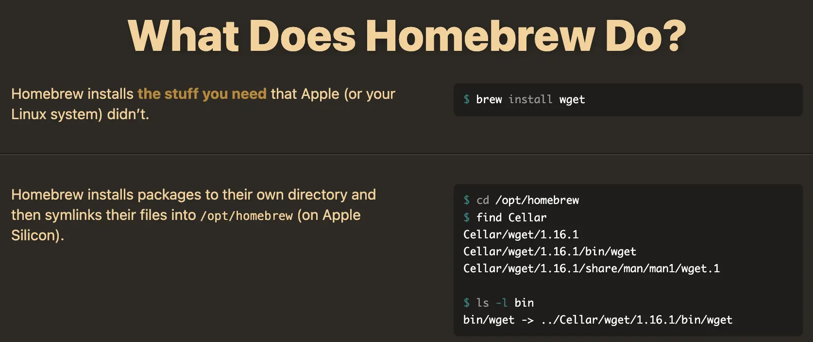

`homebrew`는 CLI로 편리하게 앱을 설치할 수 있게 해준다.

환경변수 및 패키지 폴더 구성 등을 자동으로 해주기 때문에 불쾌한 초기 설정을 벗어나게 해준다.

많은 프로젝트에서 homebrew를 통한 설치 가이드를 제공하고 있을 정도로 대중적이니 꼭 설치하자.

```sh
# 터미널 설치
$ /bin/bash -c "$(curl -fsSL https://raw.githubusercontent.com/Homebrew/install/HEAD/install.sh)"
```

> [다운로드 링크](https://brew.sh/)

## Oh My Zsh

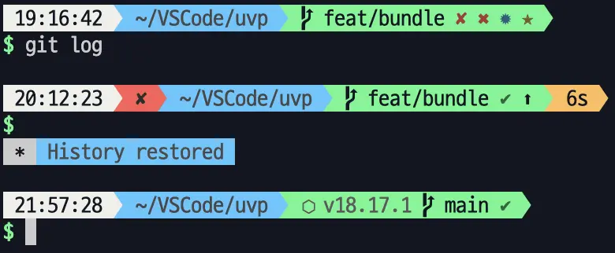

brew로 작업하다 보면 터미널이 참 못생겼다고 느낄 수 있다. 터미널을 위와 같이 원하는 정보가 노출되도록 설정할 수 있다.

내가 사용하고 있는 테마는 [bullet-train](https://github.com/caiogondim/bullet-train.zsh) 커스텀 테마이다. 해당 테마는 현재 시간 및 작업 소요 시간, 성공 여부, 깃 상태 등 다양한 정보를 노출시켜 주므로 선택하게 되었다.

```sh
# 터미널 설치
$ sh -c "$(curl -fsSL https://raw.githubusercontent.com/ohmyzsh/ohmyzsh/master/tools/install.sh)"
```

> [다운로드 링크](https://ohmyz.sh/#install)

## Iterm2

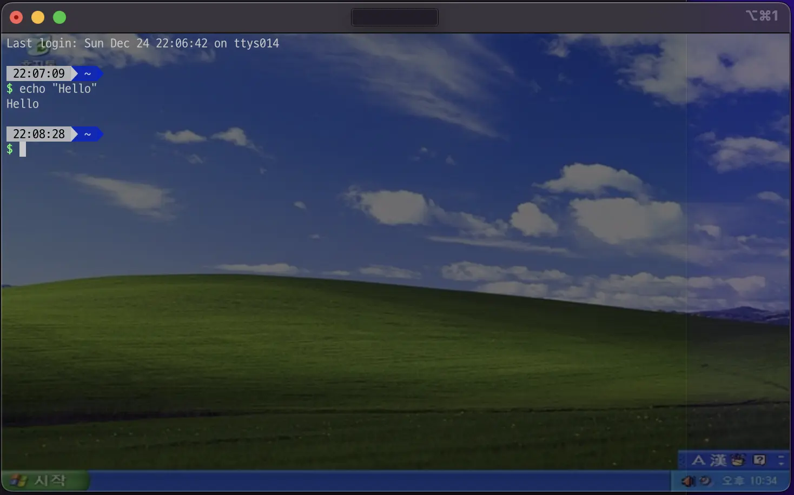

기본 맥 터미널은 못생겼기 때문에 `iterm2`을 설치해 터미널을 더 예쁘게 커스텀 할 수 있다.

`zsh`이 터미널의 내용을 관리한다면 터미널 창 자체로 디자인을 제공해 주는 역할은 `iterm2`이다.

> 만약 커맨드라인에서 cmd + delete로 [한줄 삭제](https://stackoverflow.com/questions/15733312/iterm2-delete-line) 하고 싶다면
>
> 환경 설정 > Profiles > Keys > Natural Text Editing으로 설정 한다.

이 외에도 각 탭에서 창 기본 크기, 배경 설정 등 할 수 있다.

> [다운로드 링크](https://iterm2.com/)

## VSCode

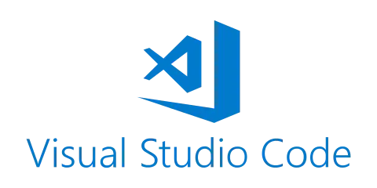

VSCode에 너무 절여져 있어 다른 에디터는 이제 기억이 나지 않는다... 유용한 익스텐션은 다음 포스트로 연재하겠다.

> [다운로드 링크](https://code.visualstudio.com/)

## NeoVim

만약 vi 환경을 좋아한다면 설치하면 좋다. 기본적으로 `vim`은 한글 입력시 문제가 많다(조합 중인 문자 소실 등).

`NeoVim`은 `vim`을 오픈소스화하여 기존의 문제들 해결하고 커뮤니티 자발적으로 다양한 플러그인을 개발/공유하고 있어 강력한 에디팅을 지원한다.

```sh
$ brew install neovim
# 기본 vi를 neovim으로 변경하고자 한다면 alias를 변경한다.
$ vi ~/.zshrc
$ alias vi="nvim"
```

> [다운로드 링크](https://neovim.io/)

## D2 Coding

폰트는 d2 코딩이 가장 편하다고 느껴서 늘 사용하고 있다.

모호할 수 있는 문자들이 `1ijIlO0tz아야저져쁆뼮뼯뗾` 기본적으로 잘 보인다(이 블로그 폰트도 D2coding이다).

### iterm2에 d2coding을 기본 폰트로 적용하기

> Profiles > Text > Font > D2Coding
>
> [그림으로 보기](https://github.com/1ilsang/dev/assets/23524849/a3aff63a-d3d7-43aa-84c1-68b10d46dadd)

### VSCode 기본 폰트로 적용하기

> Setting(cmd + ,) > Font Family > D2Coding을 제일 앞에 적어준다.
>
> [그림으로 보기](https://github.com/1ilsang/dev/assets/23524849/1eeb1e90-6a2c-4263-a8a4-f6a9ea860f98)

상당히 개발자 친화적인 폰트라 생각한다.

> [다운로드 링크](https://github.com/naver/d2codingfont)

## Node.js

"신"

> [다운로드 링크](https://nodejs.org/en)

## NVM

프로젝트를 여러개 만들다 보면 노드 버전이 상이한 경우가 종종 생긴다. 이때 노드 버전을 어떻게 처리할까?

답은 `nvm`을 통해 노드 버전을 프로젝트마다 변경하면 된다.

```sh
# Nvm 다운로드.
$ curl -o- https://raw.githubusercontent.com/nvm-sh/nvm/v0.39.7/install.sh | bash
# 터미널 실행시 자동으로 nvm을 사용하도록 설정.
$ vi ~/.zshrc
# 아래 내용을 zshrc 아무곳에 붙여넣는다.
export NVM_DIR="$([ -z "${XDG_CONFIG_HOME-}" ] && printf %s "${HOME}/.nvm" || printf %s "${XDG_CONFIG_HOME}/nvm")"
[ -s "$NVM_DIR/nvm.sh" ] && \. "$NVM_DIR/nvm.sh" # This loads nvm
# 쉘 반영
$ source ~/.zshrc
```

사용법은 아래와 같다.

```sh
# .nvmrc 파일이 존재하면 지정된 노드 버전으로 설정됨.
$ nvm use
# Node.js 20.10.0 버전 다운로드.
$ nvm install 20.10.0
# Node.js 20.10.0 버전 사용.
$ nvm use 20.10.0
```

> [가이드 링크](https://github.com/nvm-sh/nvm/blob/master/README.md)

## Docker

두 번째 "신"

> [다운로드 링크](https://www.docker.com/)

## GIPHY Capture


간단하게 움짤(gif)을 따야 할 때 유용하게 쓸 수 있다.

> [다운로드 링크](https://apps.apple.com/kr/app/giphy-capture-the-gif-maker/id668208984)

## DeepL

번역 퀄리티가 상당히 좋다. 또한 `cmd + c + c`로 빠르게 번역하기도 지원하기 때문에 숏컷 활용도 또한 뛰어나다.

이후 다룰 크롬 익스텐션과 함께 사용하면 찰떡이다.

> [다운로드 링크](https://www.deepl.com/ko/app/)

## ScreenHint

<ImageHorizonWrap slug={slug} list={['screenhint', 'screenhint-setting']} />


정말 추천하고 싶은 프로그램. 원하는 부분만 스크린샷으로 띄워 놓을 수 있다.

맥 어플 전체화면시에도 올라가 있기 때문에 상당히 편리하다.

> [다운로드 링크](https://apps.apple.com/kr/app/screenhint/id1566621533?mt=12)

## Quick Notes

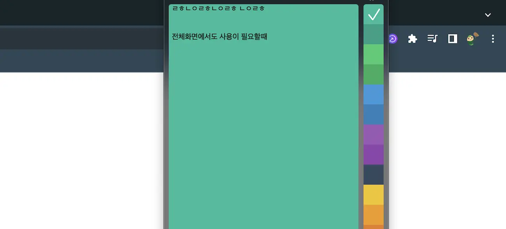

줌으로 미팅하거나 전체화면으로 열려있는 자료가 많아 잠깐잠깐 메모가 필요할 때 유용한 앱이다.

유료라서 꼭 필요한 게 아니라면 크게 추천하고 싶진 않다.

> [다운로드 링크](https://apps.apple.com/kr/app/quick-notes/id1260480179?mt=12)

## Calculator Pro

<ImageHorizonWrap slug={slug} list={['calculator-pro', 'calculator-pro-setting']} />

맥 환경 특성상 전체화면 된 앱 위에 무엇을 겹치는 것이 불가능하다. 하지만 이 앱은 계산기를 전체화면 된 앱 위에 올려준다.

알고리즘 풀 때 진짜 꿀이다.

오른쪽 화면은 내가 쓰는 글로벌 숏컷이다. 껐다켰다하며 사용하기 편하다.

> [다운로드 링크](https://apps.apple.com/kr/app/calculator-pro-topbar-app/id576215086)

## 올ㅋ사전

<ImageHorizonWrap slug={slug} list={['all-z', 'all-z-setting']} />

특정 단어를 검색해야 할 때 화면 이동을 하는 건 너무 귀찮다. 단축키로 바로 열어서 찾는 것이 편리하다.

> [다운로드 링크](https://apps.apple.com/kr/app/%EC%98%AC%E3%85%8B%EC%82%AC%EC%A0%84-%EB%A7%A5%EC%97%90%EC%84%9C-%EB%8B%A8%EC%B6%95%ED%82%A4%EB%A5%BC-%EB%88%84%EB%A5%B4%EB%A9%B4-%EC%98%81%EC%96%B4%EC%82%AC%EC%A0%84%EC%9D%B4-%EB%99%87/id1033453958?mt=12)

## CodeWhisperer

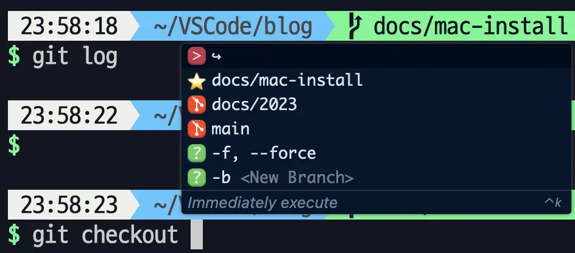

[Fig가 공식적으로 AWS에 흡수](https://fig.io/blog/post/fig-is-sunsetting)되면서 출시된 제품이다. 개인 개발에는 무료로 사용할 수 있다.

CLI를 자주 사용한다면 정말 유용한 앱이다. 다음 명령어에 대한 힌트뿐만 아니라 해당 명령어의 기대 효과도 같이 알려준다.

터미널의 효자 그 자체다.

```sh
$ brew install --cask codewhisperer
```

> [다운로드 링크](https://aws.amazon.com/ko/codewhisperer/resources/?refid=d66b5e73-988d-4ff9-aa68-e067ce087ab)

## Flycut

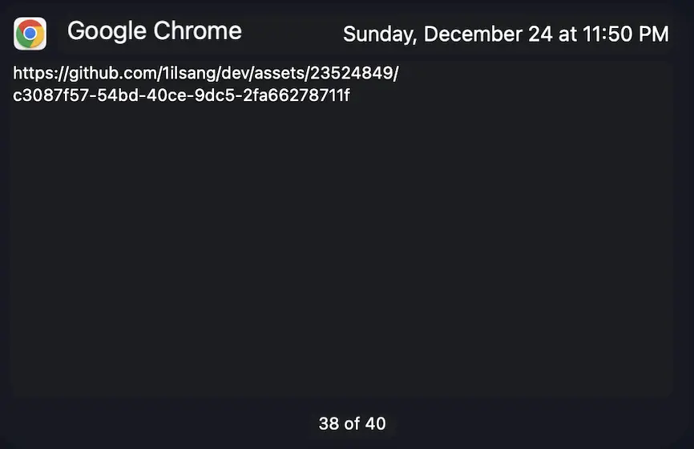

우리는 복/붙을 상당히 많이 한다. 만약 이전에 복사했던 내용을 다시 가져오고 싶다면 어떻게 하고 있는지 생각해 보자.

별다른 수가 떠오르지 않는다면 이 앱을 추천한다. 이 앱은 이전에 복사했던 내용들을 기억하고 불러오는 것도 지원해 준다. 심지어 복사된 시간도 알려준다.

> [다운로드 링크](https://apps.apple.com/kr/app/flycut-clipboard-manager/id442160987?mt=12)

## ScreenBrush

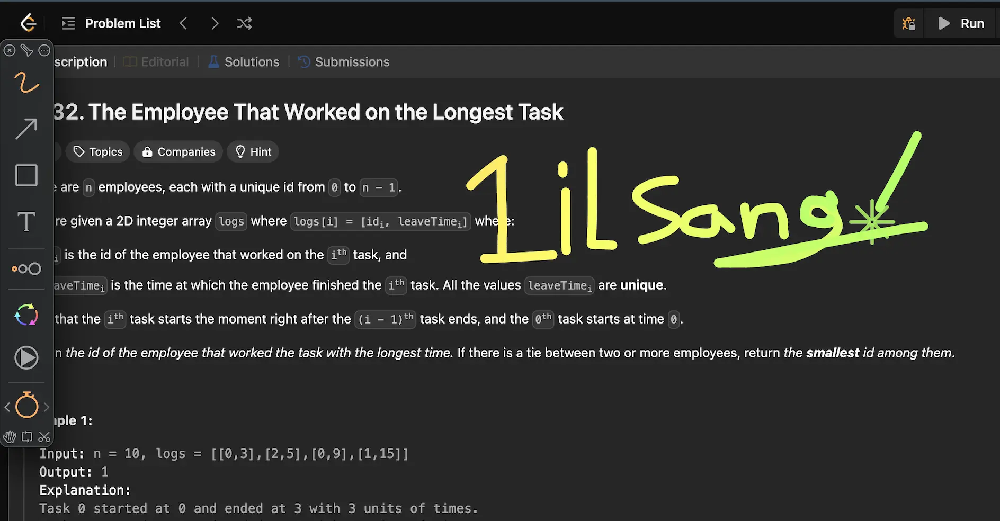

줌과 같은 화상 회의를 할 때나 전체 미팅 때 내 화면을 공유할 일이 많다면 강력히 추천한다.

화면에 무엇인가 작성하거나 포인터가 필요할 때 예쁘게 시선을 잡아주는 효자 앱이다.

> [다운로드 링크](https://apps.apple.com/kr/app/screenbrush/id1233965871?mt=12)

## Keycastr

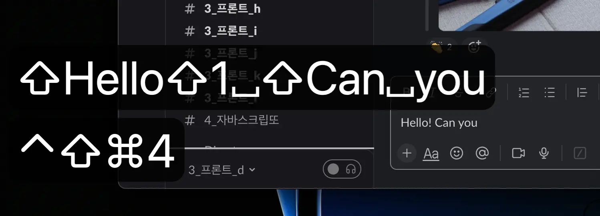

`ScreenBrush`와 함께 사용하면 빛나는 앱이다. 내가 어떤 키보드를 입력했는지 화면에 보여준다.

```sh
$ brew install --cask keycastr
```

> [다운로드 링크](https://github.com/keycastr/keycastr)

## Ngrok

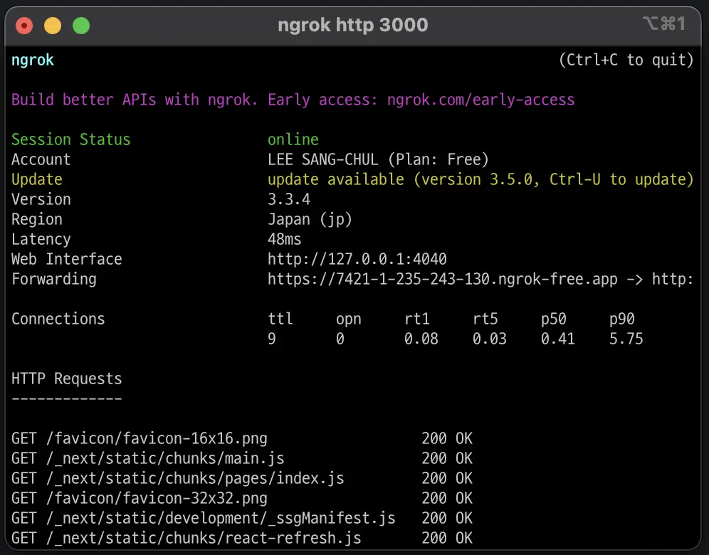

배포 없이 로컬에서 작업한 나의 페이지를 다른 사람에게 보여주고 싶다면 어떻게 해야 할까?

`ngrok`은 프록시 서버를 열어 내 로컬 포트로 접근하게 해준다. 서버 없이 빠르게 데모 페이지를 공유할 때 유용하다.

```sh
$ ngrok http 3000 # 3000번 포트로 http 통신을 허용한다.
# 위의 이미지처럼 https://7421-1-235-243-130.ngrok-free.app URL이 생성(일회용 랜덤)된다.
# 이후 해당 URL로 접근하면 localhost:3000으로 접속한 것과 같이 된다.
# 이로써 정적 배포/서버 없이 누구에게나 열린 일회용 퍼블릭 URL을 가지게 되었다!
```

단, 사용하기 위해선 로그인 이후 인증 토큰을 넣어야 한다.

> [다운로드 링크](https://ngrok.com/download)

## Hidden bar

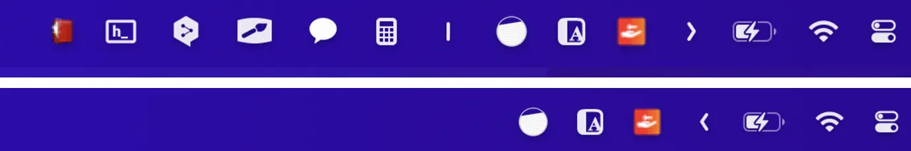

이쯤 되면 상단바가 상당히 늘어났다는 것을 확인할 수 있다. `Hidden bar`는 필요한 앱들만 상단바에 노출시켜 주는 앱이다.

> [다운로드 링크](https://apps.apple.com/kr/app/hidden-bar/id1452453066?mt=12)

## Digital Color Meter

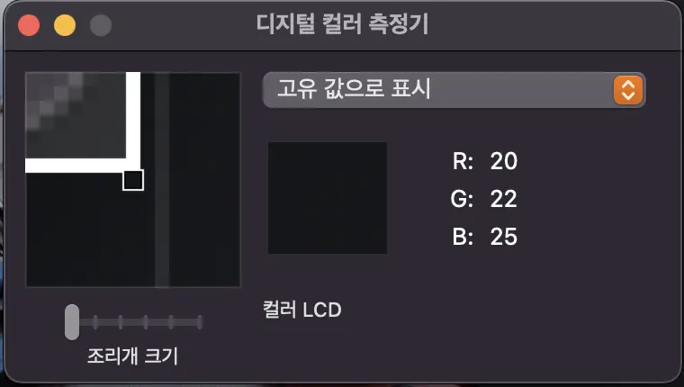

맥 자체 유용한 앱이다. CSS 작업을 하다 보면 스포이드가 필요한 순간이 있는데 유용하게 사용할 수 있다.
